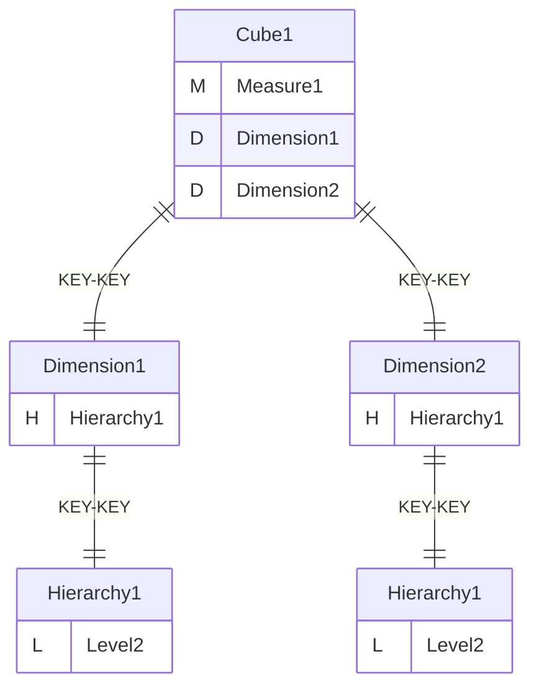
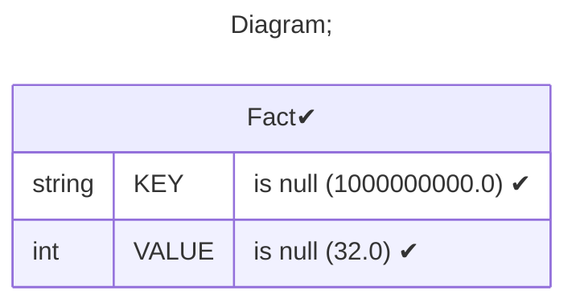
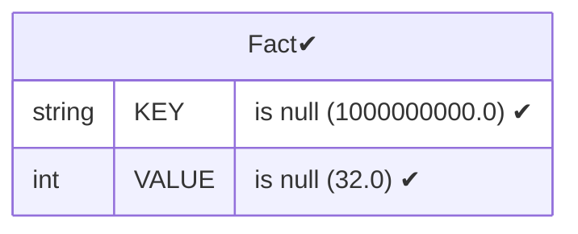
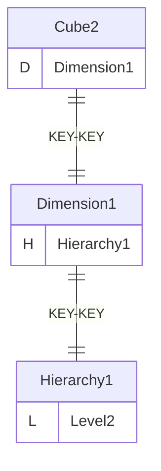
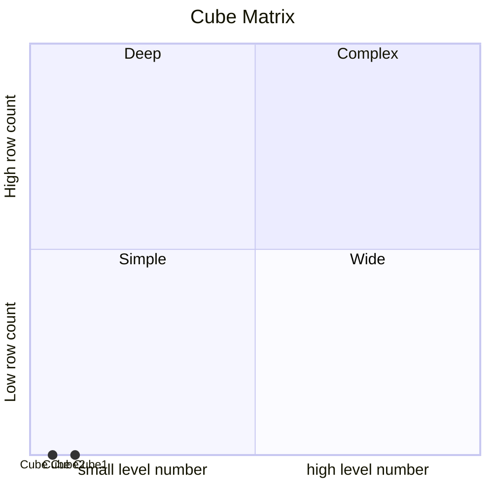

# Documentation
### CatalogName : Cube_with_role_access_all_none_custom
### Schema Cube_with_role_access_all_none_custom : 
---
### Cubes :

    Cube1, Cube2

---
#### Cube "Cube1":

    

##### Table: "Fact"

##### Dimensions:
##### Dimension "Dimension1":

Hierarchies:

    Hierarchy1

##### Hierarchy Hierarchy1:

Tables: "Fact"

Levels: "Level2"

###### Level "Level2" :

    column(s): KEY

##### Dimension "Dimension2":

Hierarchies:

    Hierarchy1

##### Hierarchy Hierarchy1:

Tables: "Fact"

Levels: "Level2"

###### Level "Level2" :

    column(s): KEY

---
#### Cube "Cube2":

    

##### Table: "Fact"

##### Dimensions:
##### Dimension "Dimension1":

Hierarchies:

    Hierarchy1

##### Hierarchy Hierarchy1:

Tables: "Fact"

Levels: "Level2"

###### Level "Level2" :

    column(s): KEY

### Roles :##### Role: "role1"

##### Role: "role11"

##### Role: "role12"

##### Role: "role2"

##### Role: "role3"

##### Role: "role3"

##### Role: "manager"

##### Role: "role_u"

### Cube "Cube1" diagram:

---

---
### Database :
---

---
" Aggregation section:

---

---
### Cube "Cube2" diagram:

---

---
### Database :
---

---
" Aggregation section:

---

---
### Cube Matrix for Cube_with_role_access_all_none_custom:

---
### Database :
---

---
