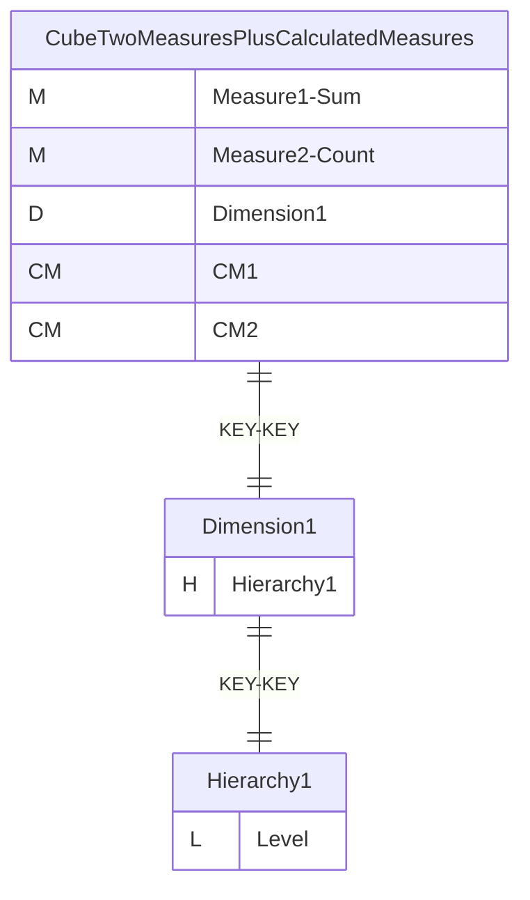
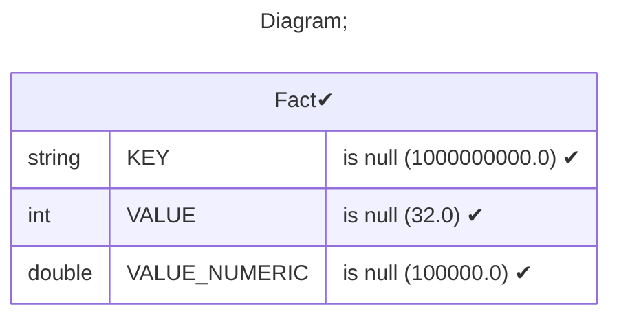
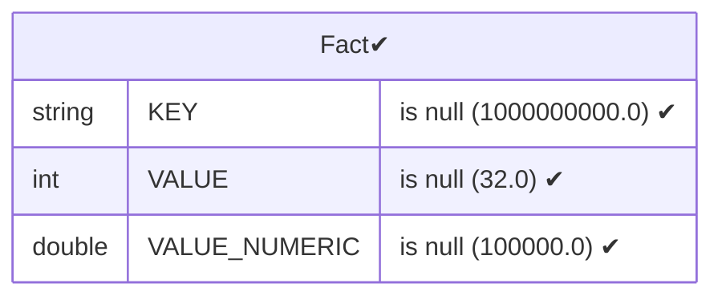
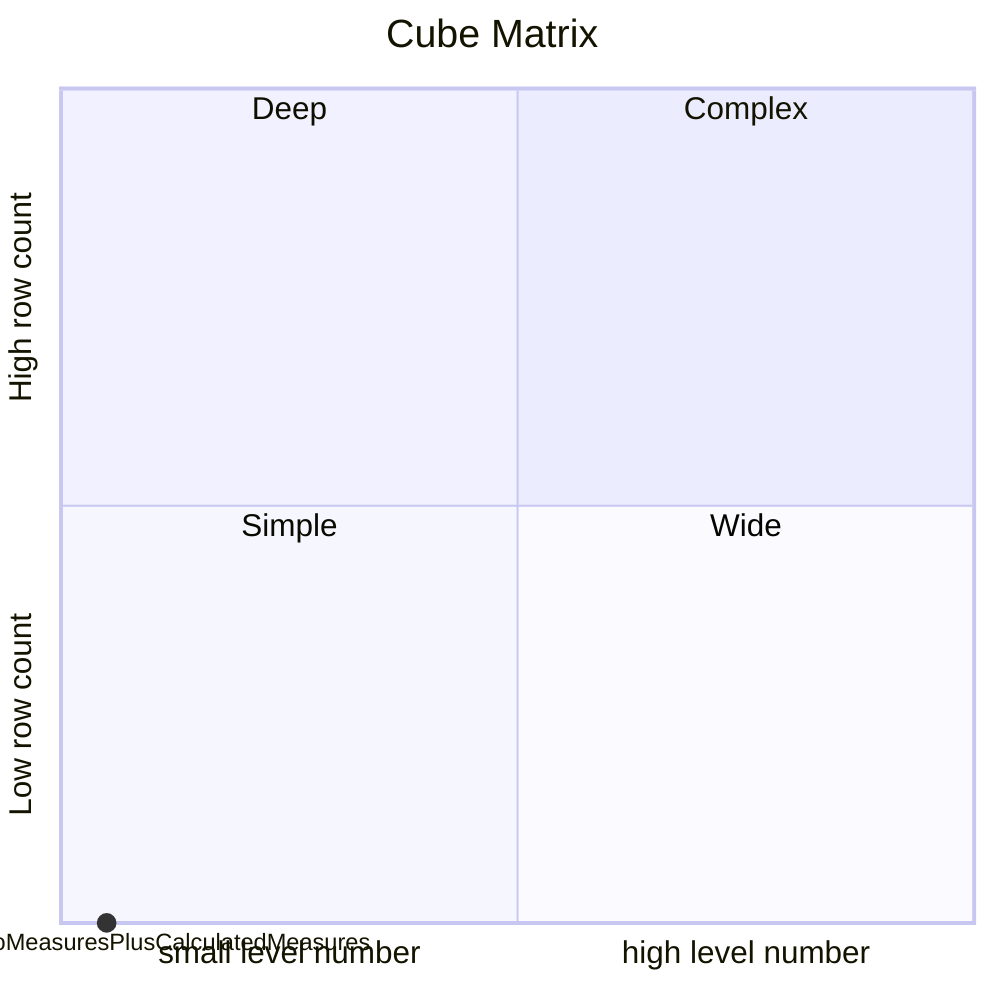

# Documentation
### CatalogName : Minimal_Cubes_With_Two_Calculated_Members
### Schema Minimal_Cubes_With_Two_Calculated_Members : 
---
### Cubes :

    CubeTwoMeasuresPlusCalculatedMeasures

---
#### Cube "CubeTwoMeasuresPlusCalculatedMeasures":

    

##### Table: "Fact"

##### Dimensions:
##### Dimension "Dimension1":

Hierarchies:

    Hierarchy1

##### Hierarchy Hierarchy1:

Tables: "Fact"

Levels: "Level"

###### Level "Level" :

    column(s): KEY

### Cube "CubeTwoMeasuresPlusCalculatedMeasures" diagram:

---

---
### Database :
---

---
" Aggregation section:

---

---
### Cube Matrix for Minimal_Cubes_With_Two_Calculated_Members:

---
### Database :
---

---
