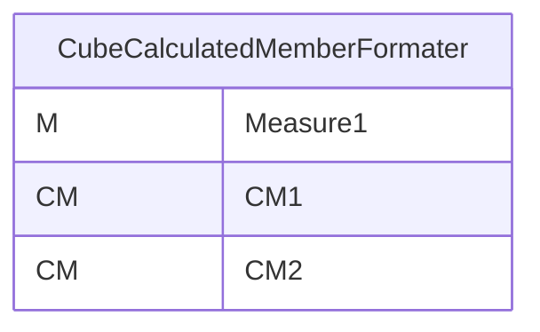
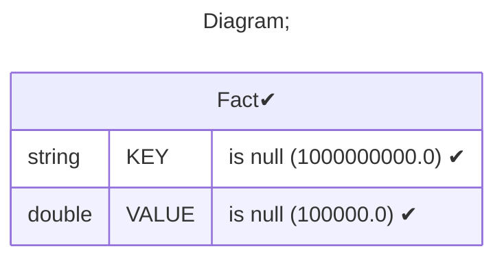
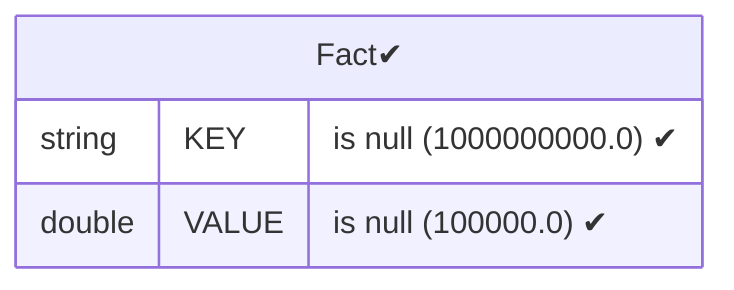
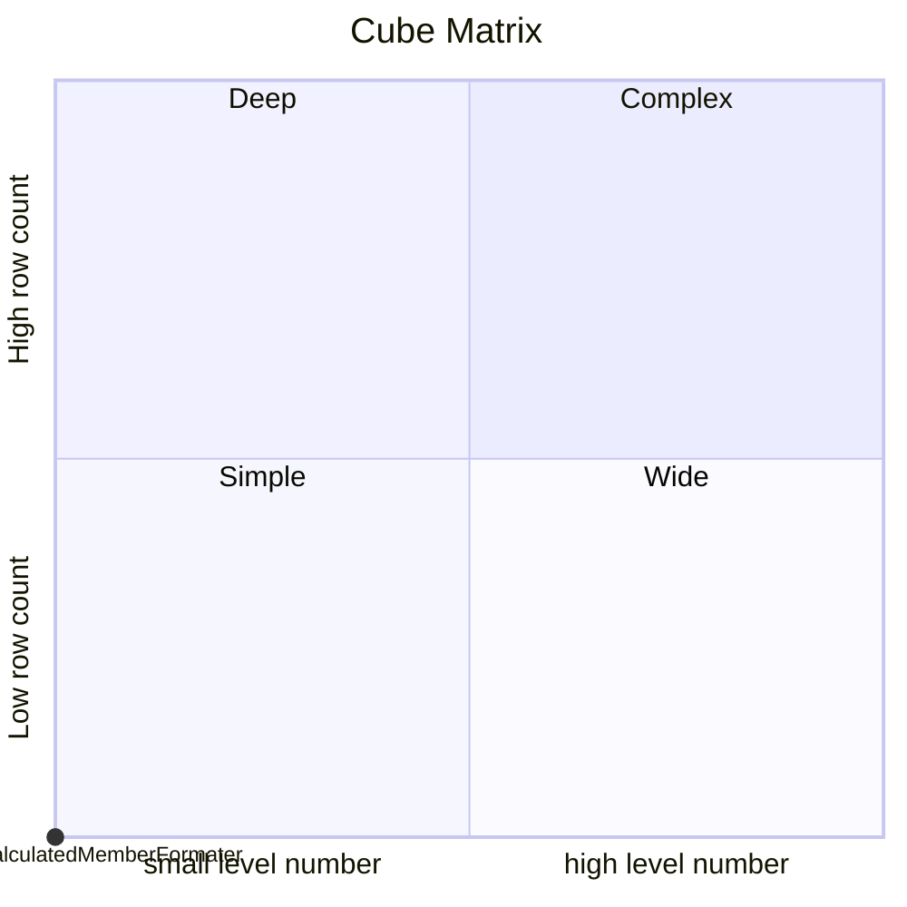

# Documentation
### CatalogName : Minimal_Cube_With_CalculatedMember_CellFormatter
### Schema Minimal_Cube_With_CalculatedMember_CellFormatter : 
---
### Cubes :

    CubeCalculatedMemberFormater

---
#### Cube "CubeCalculatedMemberFormater":

    

##### Table: "Fact"

### Cube "CubeCalculatedMemberFormater" diagram:

---

---
### Database :
---

---
" Aggregation section:

---

---
### Cube Matrix for Minimal_Cube_With_CalculatedMember_CellFormatter:

---
### Database :
---

---
