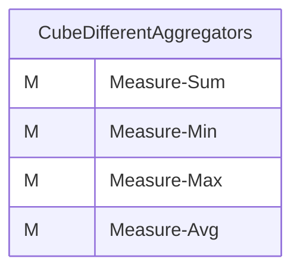
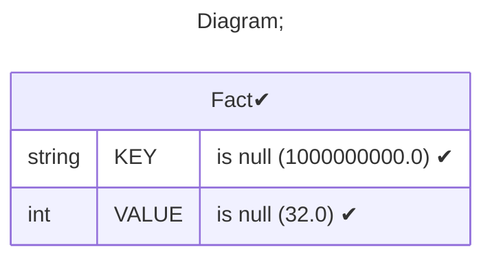
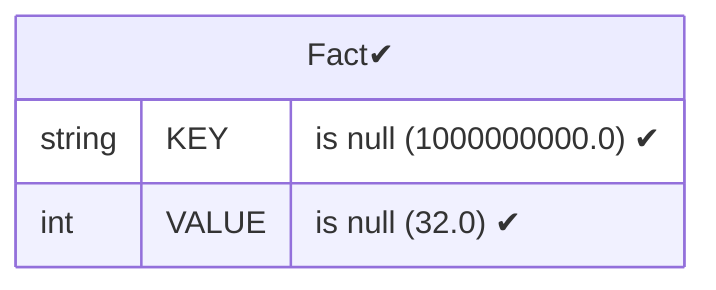
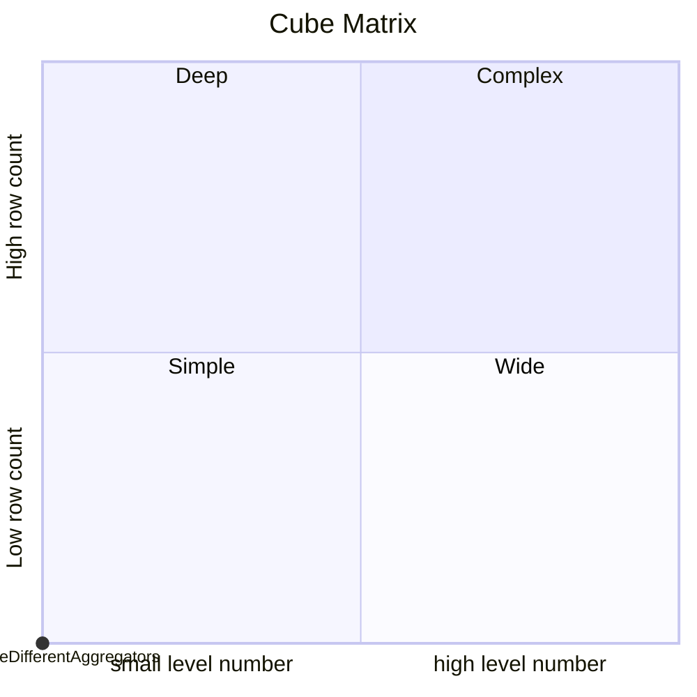

# Documentation
### CatalogName : 01-03_Minimal_Cube_With_One_Measure_And_Different_Aggregators
### Schema 01-03_Minimal_Cube_With_One_Measure_And_Different_Aggregators : 
---
### Cubes :

    CubeDifferentAggregators

---
#### Cube "CubeDifferentAggregators":

    

##### Table: "Fact"

### Cube "CubeDifferentAggregators" diagram:

---

---
### Database :
---

---
" Aggregation section:

---

---
### Cube Matrix for 01-03_Minimal_Cube_With_One_Measure_And_Different_Aggregators:

---
### Database :
---

---
