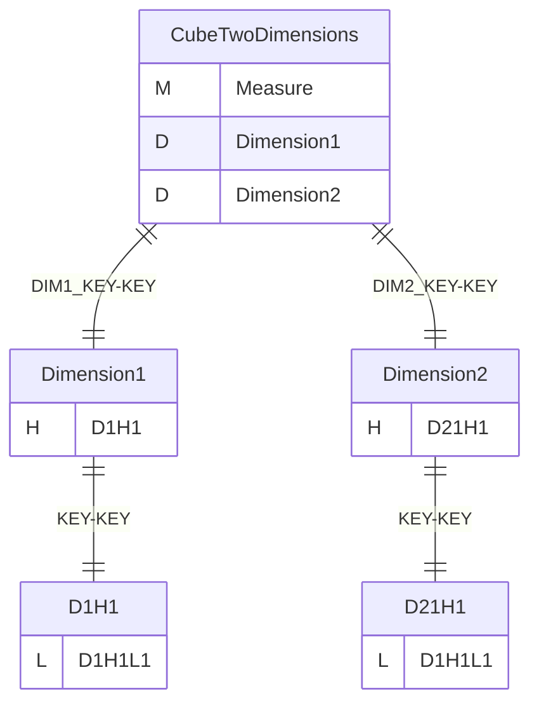
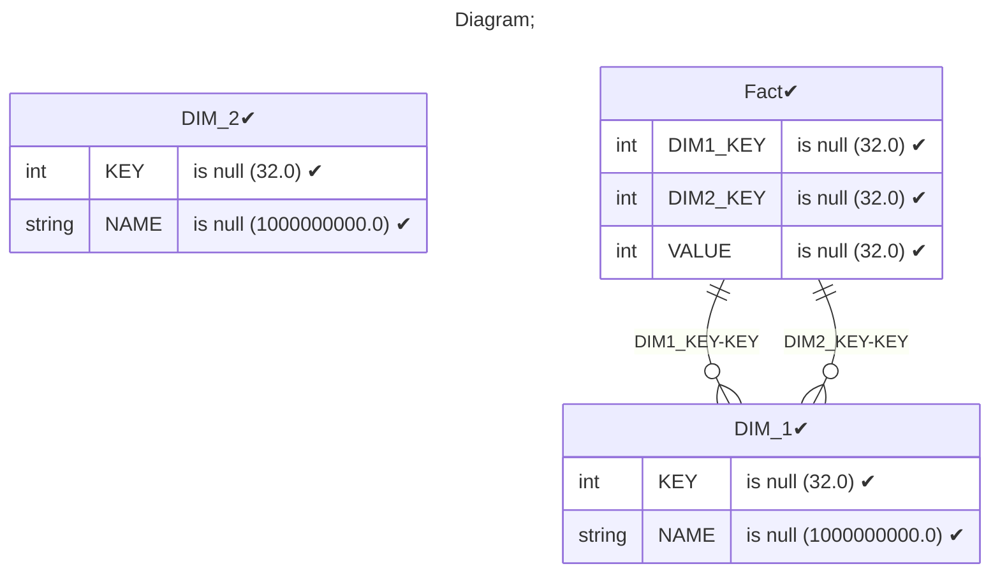
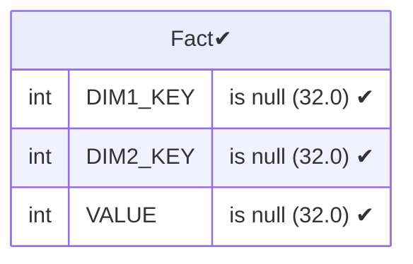
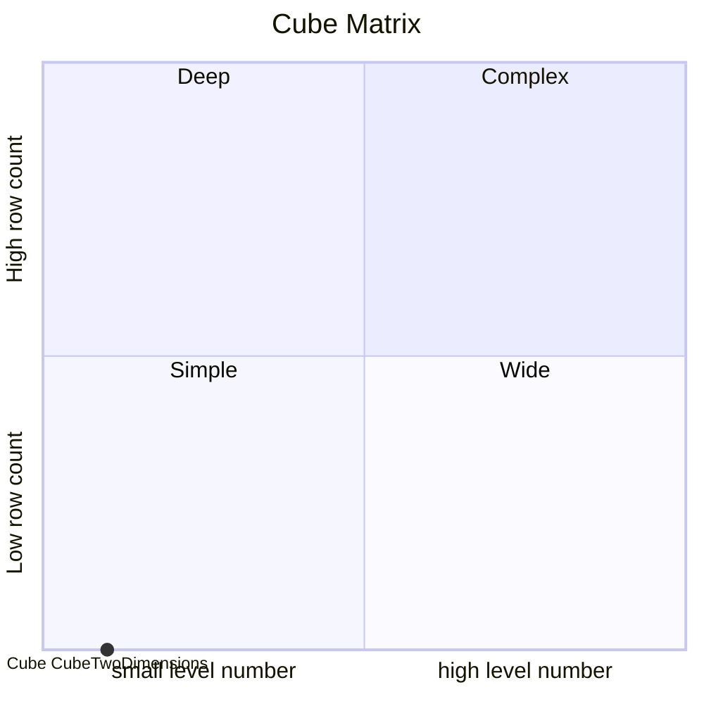

# Documentation
### CatalogName : Minimal_Two_Dimensions
### Schema Minimal_Two_Dimensions : 
---
### Cubes :

    CubeTwoDimensions

---
#### Cube "CubeTwoDimensions":

    

##### Table: "Fact"

##### Dimensions:
##### Dimension "Dimension1":

Hierarchies:

    D1H1

##### Hierarchy D1H1:

Tables: "DIM_1"

Levels: "D1H1L1"

###### Level "D1H1L1" :

    column(s): KEY

##### Dimension "Dimension2":

Hierarchies:

    D21H1

##### Hierarchy D21H1:

Tables: "DIM_1"

Levels: "D1H1L1"

###### Level "D1H1L1" :

    column(s): KEY

### Cube "CubeTwoDimensions" diagram:

---

---
### Database :
---

---
" Aggregation section:

---

---
### Cube Matrix for Minimal_Two_Dimensions:

---
### Database :
---

---
