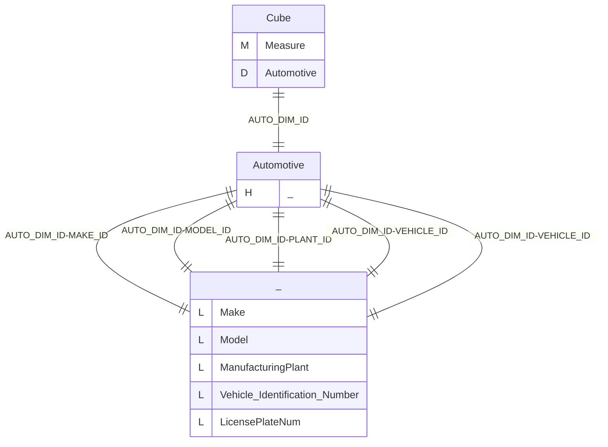
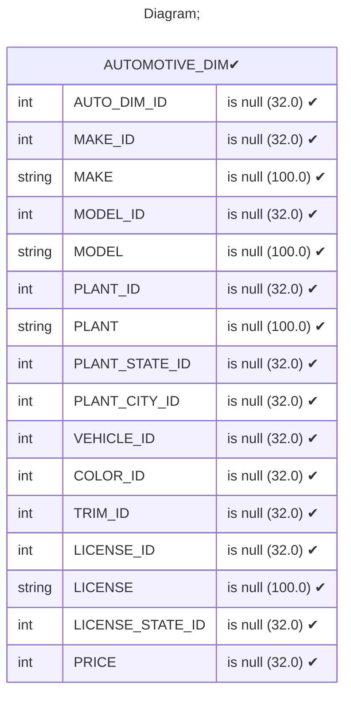
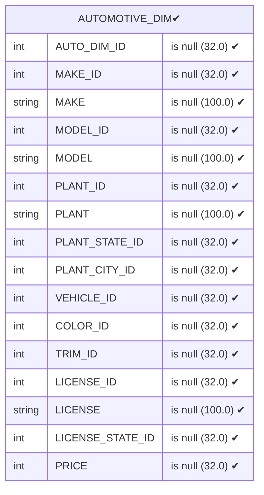
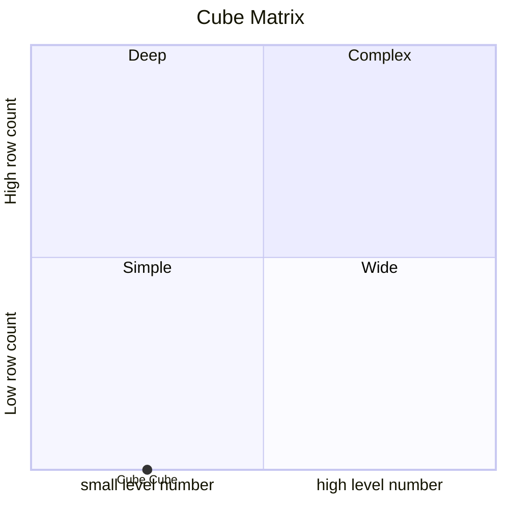

# Documentation
### CatalogName : Minimal_Cube_with_cube_dimension_with_functional_dependency_optimizations
### Schema Minimal_Cube_with_cube_dimension_with_functional_dependency_optimizations : 
---
### Cubes :

    Cube

---
#### Cube "Cube":

    

##### Table: "AUTOMOTIVE_DIM"

##### Dimensions:
##### Dimension "Automotive":

Hierarchies:

    Hierarchy0

##### Hierarchy Hierarchy0:

Tables: "AUTOMOTIVE_DIM"

Levels: "Make, Model, ManufacturingPlant, Vehicle Identification Number, LicensePlateNum"

###### Level "Make" :

    column(s): MAKE_ID

###### Level "Model" :

    column(s): MODEL_ID

###### Level "ManufacturingPlant" :

    column(s): PLANT_ID

###### Level "Vehicle Identification Number" :

    column(s): VEHICLE_ID

###### Level "LicensePlateNum" :

    column(s): VEHICLE_ID

### Cube "Cube" diagram:

---

---
### Database :
---

---
" Aggregation section:

---

---
### Cube Matrix for Minimal_Cube_with_cube_dimension_with_functional_dependency_optimizations:

---
### Database :
---

---
