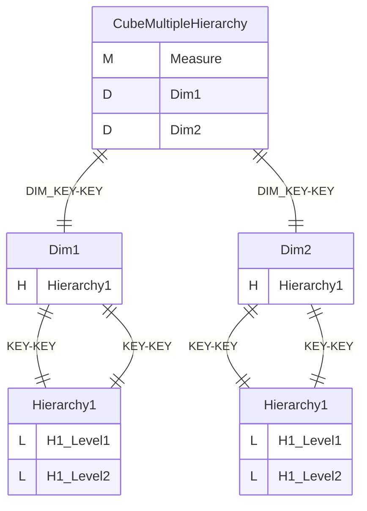
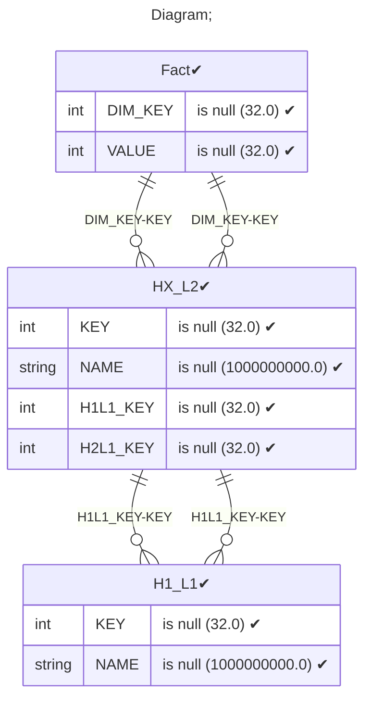
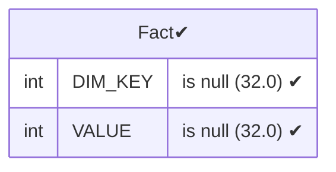
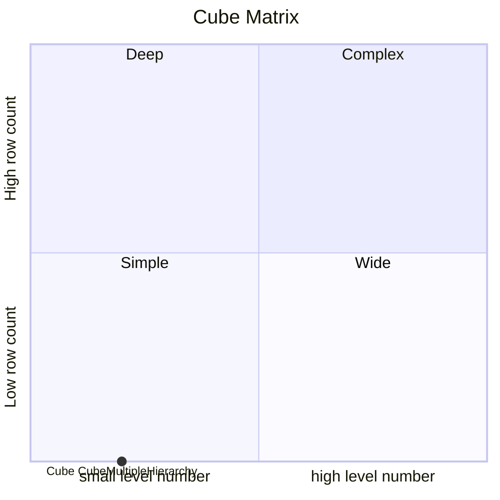

# Documentation
### CatalogName : Minimal_Cube_with_cube_dimension_level_attribute
### Schema Minimal_Cube_with_cube_dimension_level_attribute : 
---
### Cubes :

    CubeMultipleHierarchy

---
#### Cube "CubeMultipleHierarchy":

    

##### Table: "Fact"

##### Dimensions:
##### Dimension "Dim1":

Hierarchies:

    Hierarchy1

##### Hierarchy Hierarchy1:

Tables: "HX_L2,H1_L1"

Levels: "H1_Level1, H1_Level2"

###### Level "H1_Level1" :

    column(s): KEY

###### Level "H1_Level2" :

    column(s): KEY

##### Dimension "Dim2":

Hierarchies:

    Hierarchy1

##### Hierarchy Hierarchy1:

Tables: "HX_L2,H1_L1"

Levels: "H1_Level1, H1_Level2"

###### Level "H1_Level1" :

    column(s): KEY

###### Level "H1_Level2" :

    column(s): KEY

### Cube "CubeMultipleHierarchy" diagram:

---

---
### Database :
---

---
" Aggregation section:

---

---
### Cube Matrix for Minimal_Cube_with_cube_dimension_level_attribute:

---
### Database :
---

---
