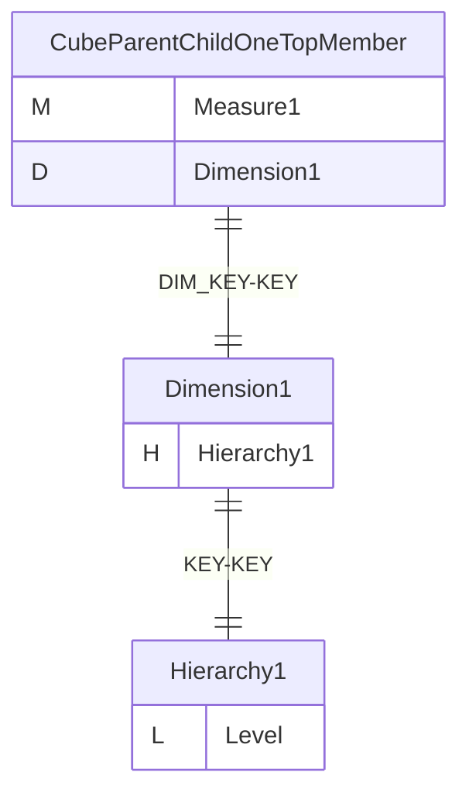
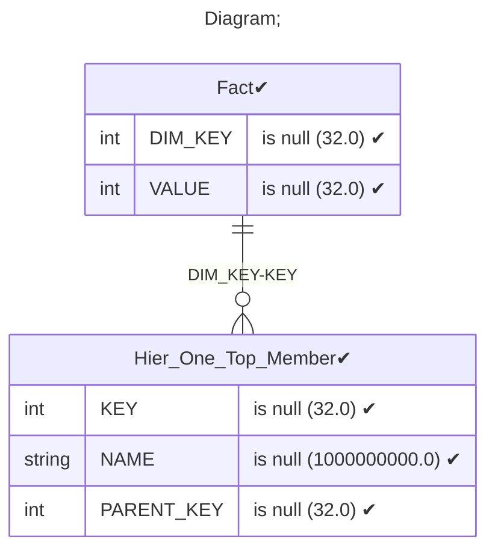
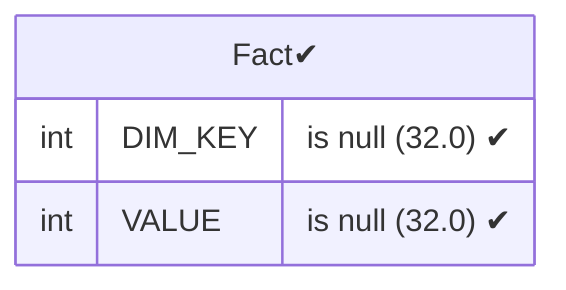
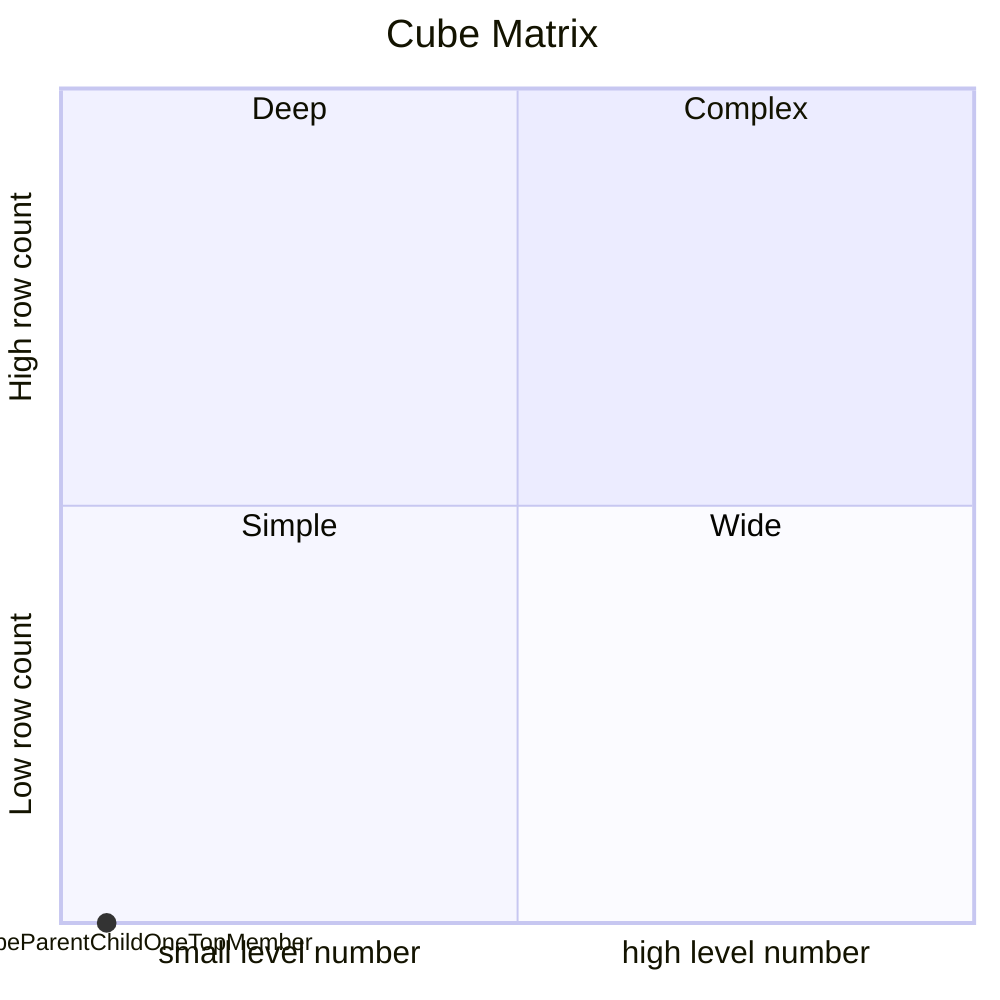

# Documentation
### CatalogName : Minimal_Parent_Child_Hierarchy
### Schema Minimal_Parent_Child_Hierarchy : 
---
### Cubes :

    CubeParentChildOneTopMember

---
#### Cube "CubeParentChildOneTopMember":

    

##### Table: "Fact"

##### Dimensions:
##### Dimension "Dimension1":

Hierarchies:

    Hierarchy1

##### Hierarchy Hierarchy1:

Tables: "Hier_One_Top_Member"

Levels: "Level"

###### Level "Level" :

    column(s): KEY

### Cube "CubeParentChildOneTopMember" diagram:

---

---
### Database :
---

---
" Aggregation section:

---

---
### Cube Matrix for Minimal_Parent_Child_Hierarchy:

---
### Database :
---

---
