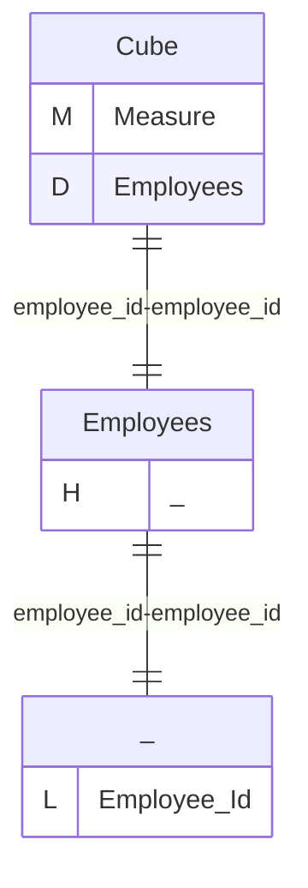
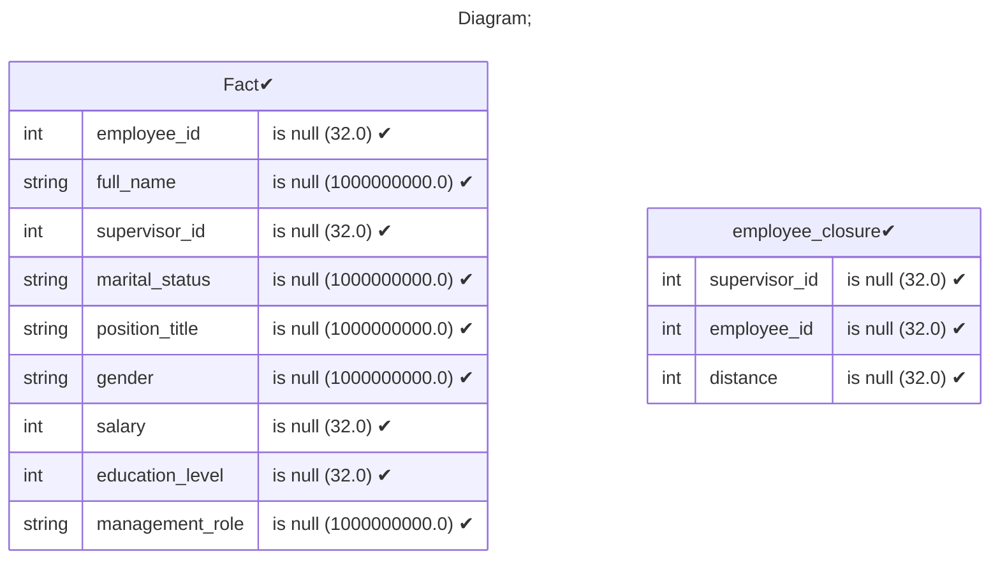
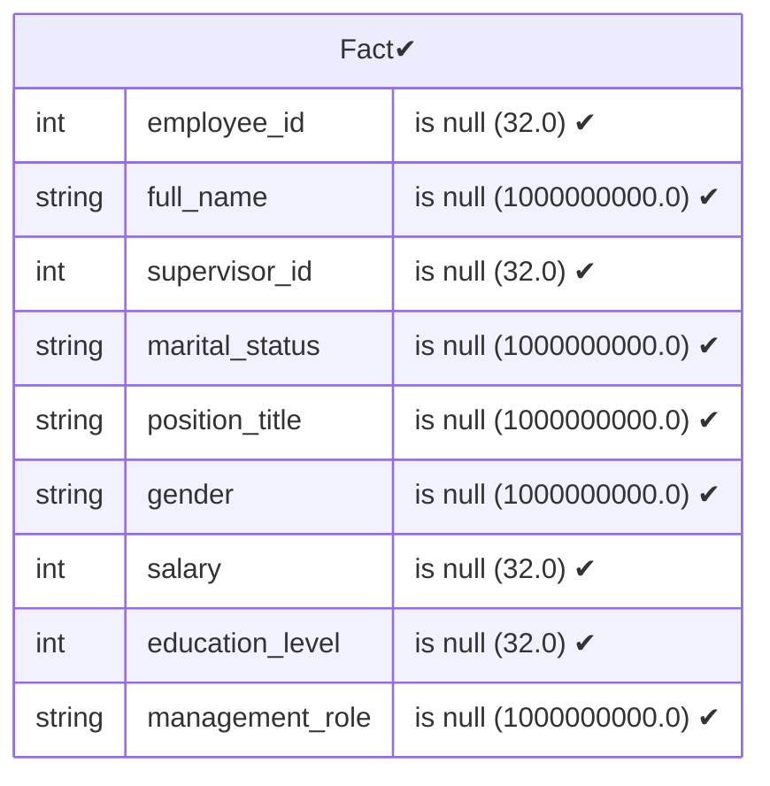
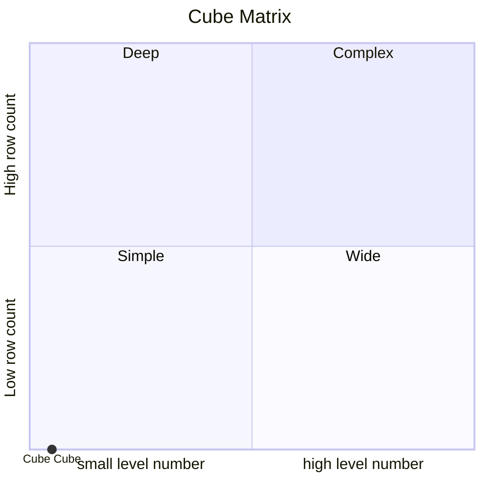

# Documentation
### CatalogName : Minimal_Cube_with_cube_dimension_level_with_closure_table
### Schema Minimal_Cube_with_cube_dimension_level_with_closure_table : 
---
### Cubes :

    Cube

---
#### Cube "Cube":

    

##### Table: "Fact"

##### Dimensions:
##### Dimension "Employees":

Hierarchies:

    Hierarchy0

##### Hierarchy Hierarchy0:

Tables: "Fact"

Levels: "Employee Id"

###### Level "Employee Id" :

    column(s): employee_id

### Cube "Cube" diagram:

---

---
### Database :
---

---
" Aggregation section:

---

---
### Cube Matrix for Minimal_Cube_with_cube_dimension_level_with_closure_table:

---
### Database :
---

---
