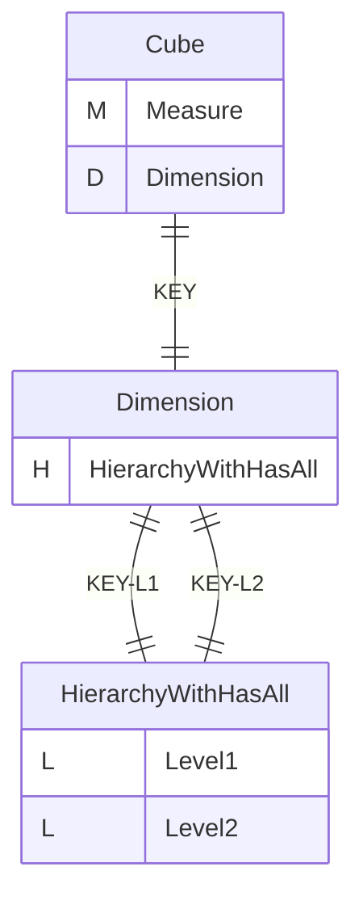
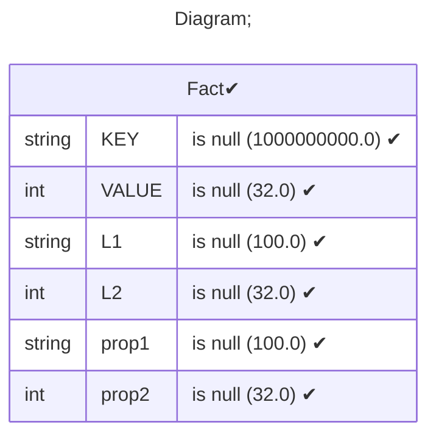
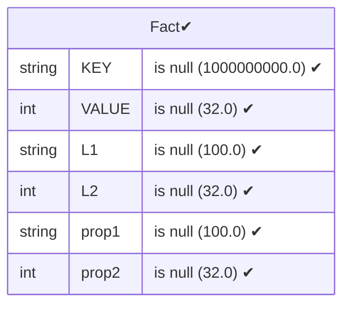
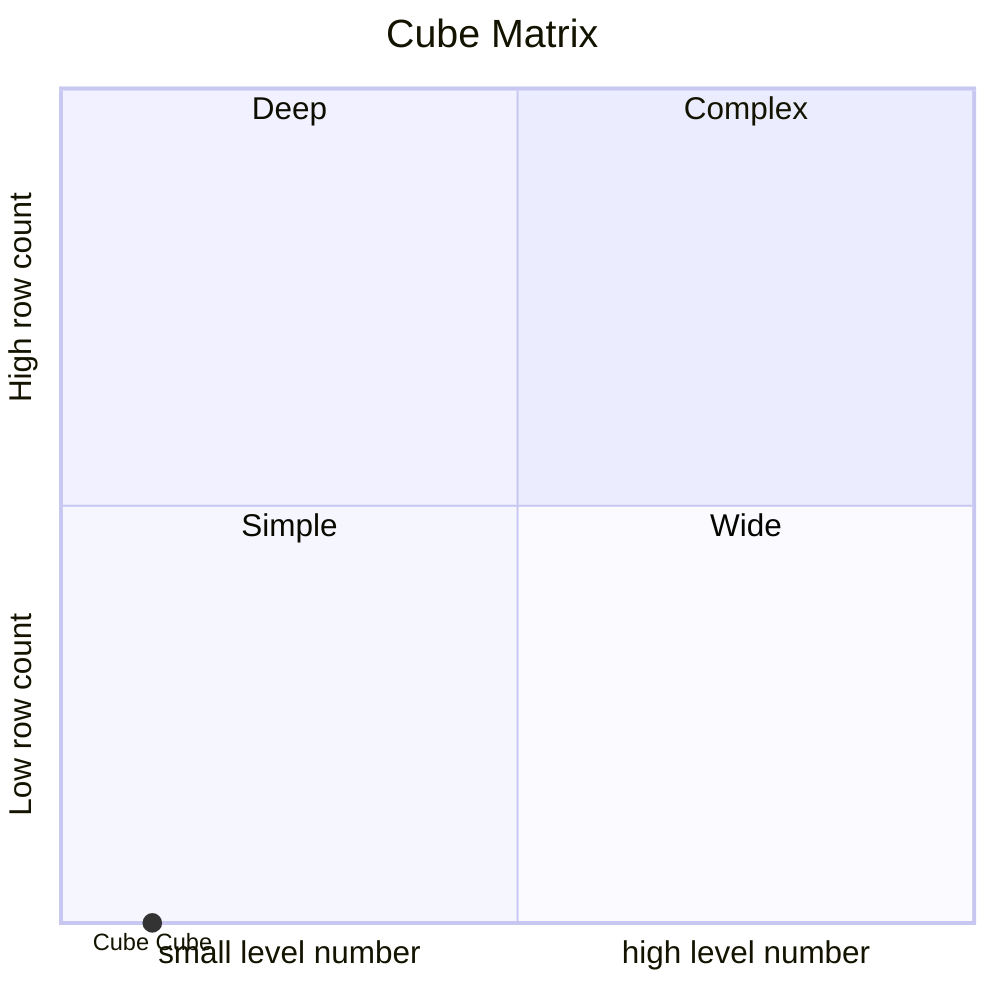

# Documentation
### CatalogName : Minimal_Cube_with_cube_dimension_with_multy_level_with_property
### Schema Minimal_Cube_with_cube_dimension_with_multy_level_with_property : 
---
### Cubes :

    Cube

---
#### Cube "Cube":

    

##### Table: "Fact"

##### Dimensions:
##### Dimension "Dimension":

Hierarchies:

    HierarchyWithHasAll

##### Hierarchy HierarchyWithHasAll:

Tables: "Fact"

Levels: "Level1, Level2"

###### Level "Level1" :

    column(s): L1

###### Level "Level2" :

    column(s): L2

### Cube "Cube" diagram:

---

---
### Database :
---

---
" Aggregation section:

---

---
### Cube Matrix for Minimal_Cube_with_cube_dimension_with_multy_level_with_property:

---
### Database :
---

---
