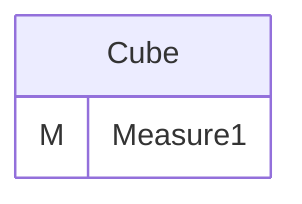
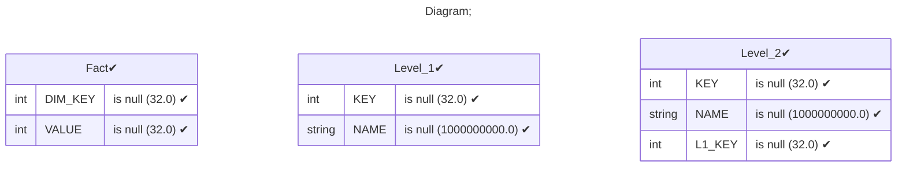
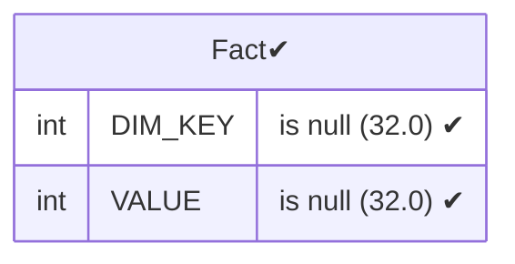
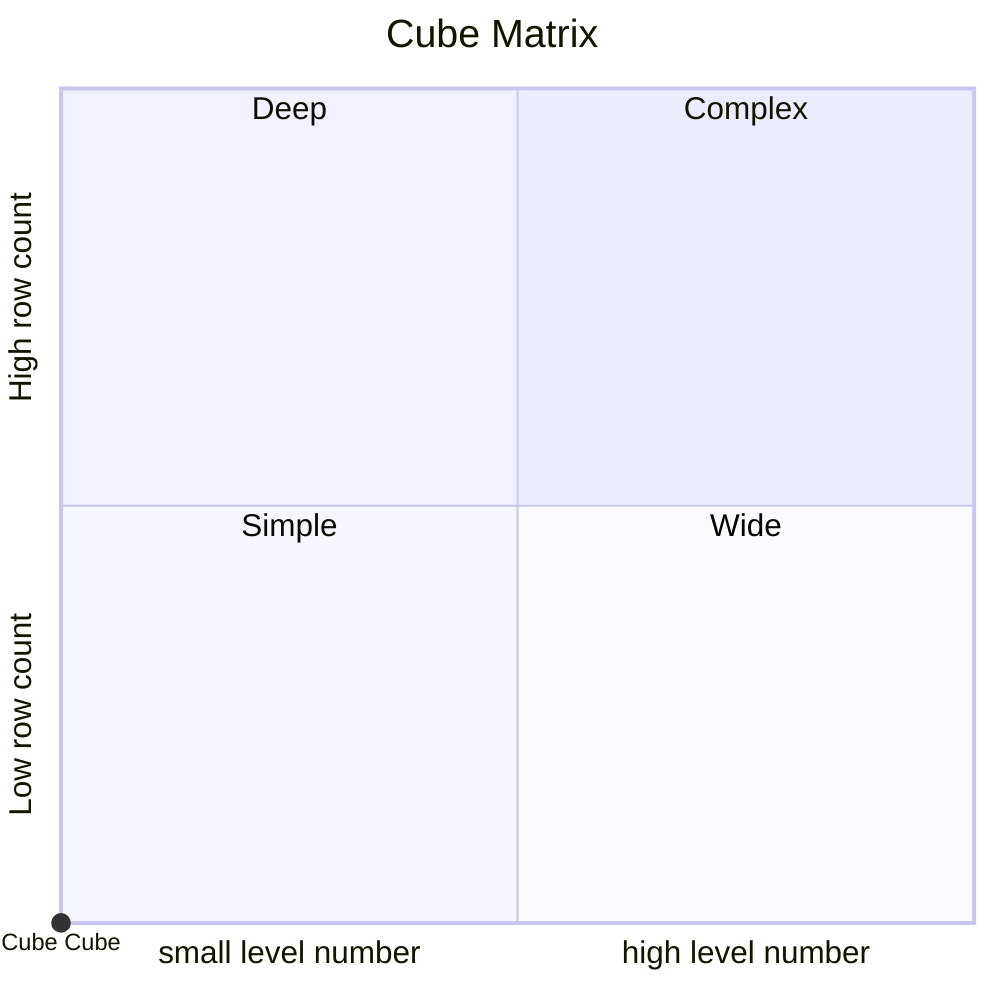

# Documentation
### CatalogName : Cube_with_hierarchy_with_table_reference_with_inner_join
### Schema Cube_with_hierarchy_with_table_reference_with_inner_join : 
---
### Cubes :

    Cube

---
#### Cube "Cube":

    

##### Table: "Fact"

### Cube "Cube" diagram:

---

---
### Database :
---

---
" Aggregation section:

---

---
### Cube Matrix for Cube_with_hierarchy_with_table_reference_with_inner_join:

---
### Database :
---

---
