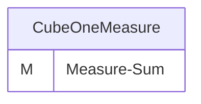
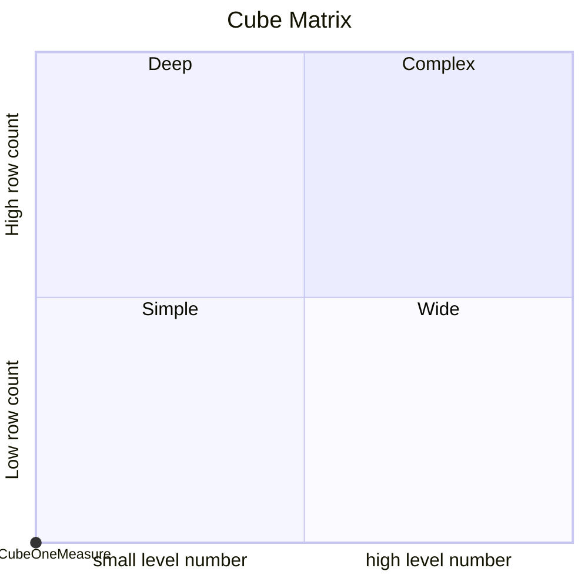

# Documentation
### CatalogName : CubeOneMeasureInlineTable
### Schema CubeOneMeasureInlineTable : 
---
### Cubes :

    CubeOneMeasure

---
#### Cube "CubeOneMeasure":

    

##### Table: ""

### Cube "CubeOneMeasure" diagram:

---

---
### Cube Matrix for CubeOneMeasureInlineTable:

---
