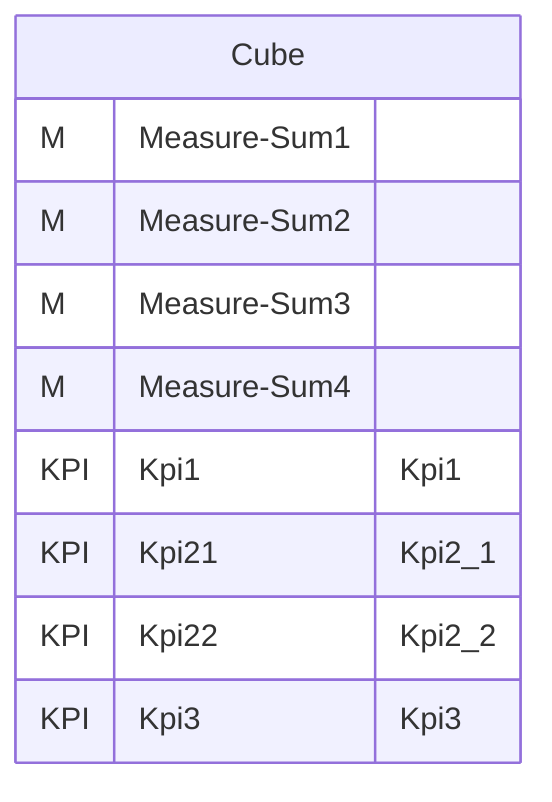
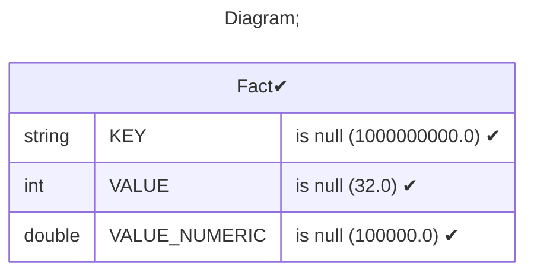
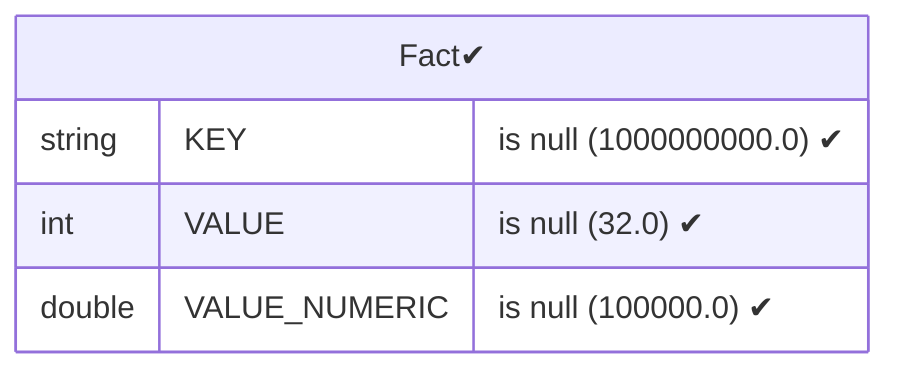
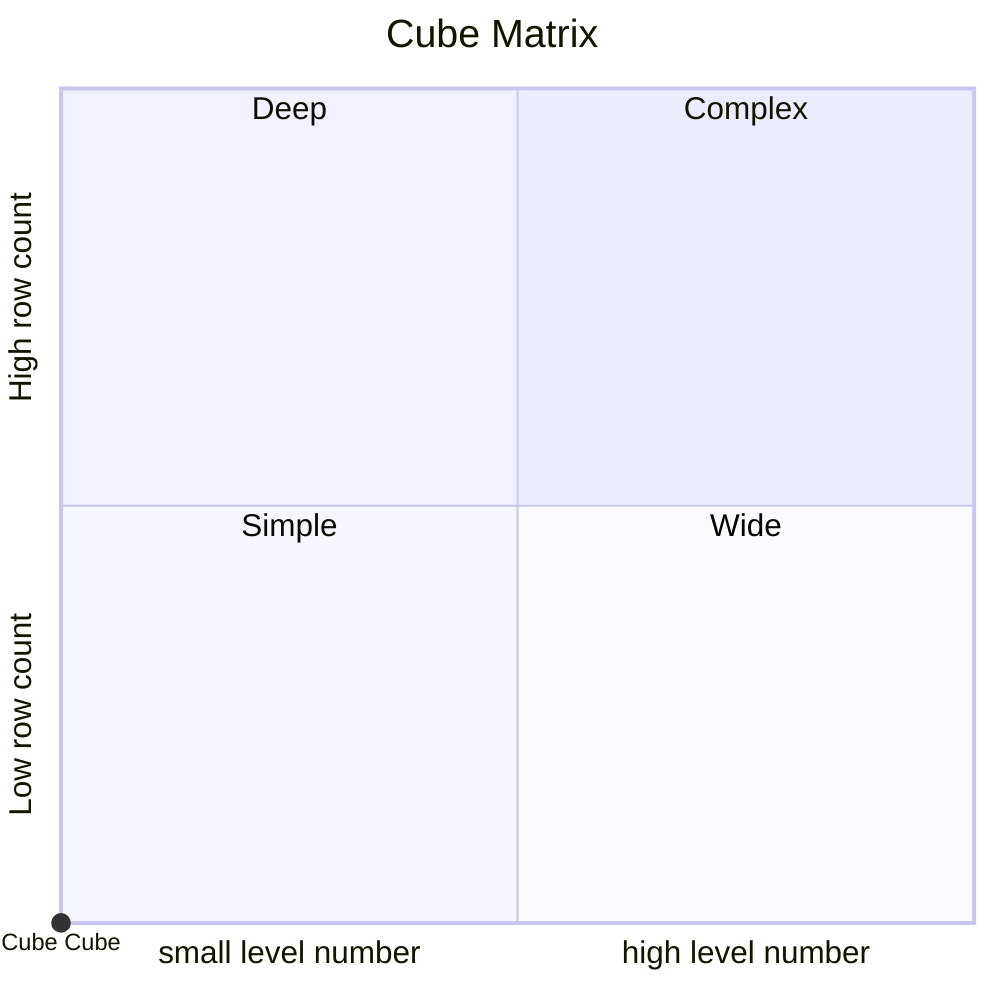

# Documentation
### CatalogName : Minimal_Cubes_With_KPI_with_parent
### Schema Minimal_Cubes_With_KPI_with_parent : 
---
### Cubes :

    Cube

---
#### Cube "Cube":

    

##### Table: "Fact"

### Cube "Cube" diagram:

---

---
### Database :
---

---
" Aggregation section:

---

---
### Cube Matrix for Minimal_Cubes_With_KPI_with_parent:

---
### Database :
---

---
