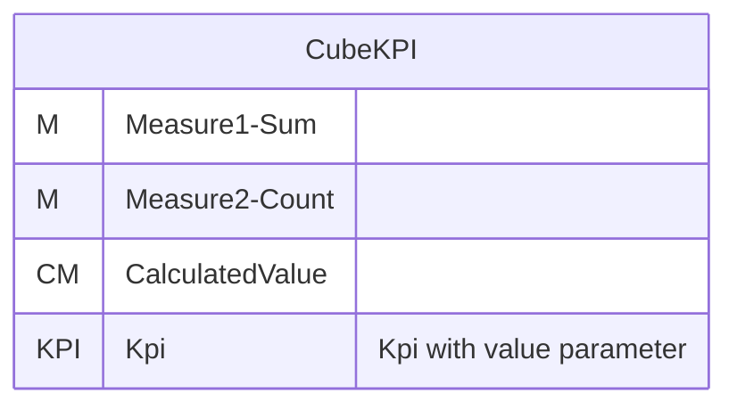
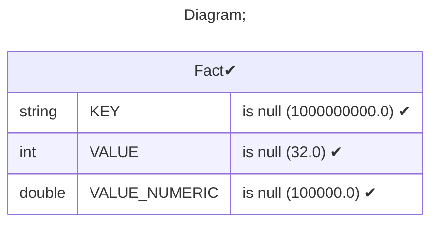
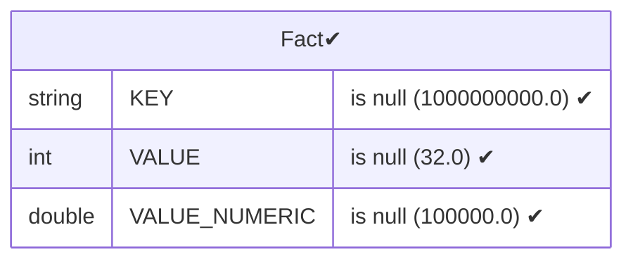
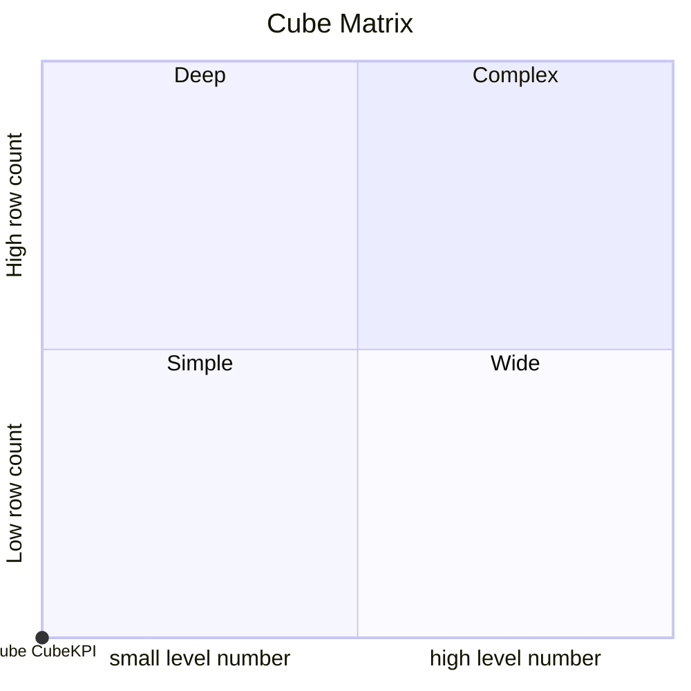

# Documentation
### CatalogName : Minimal_Cubes_With_KPI_Value_Poperty
### Schema Minimal_Cubes_With_KPI_Value_Poperty : 
---
### Cubes :

    CubeKPI

---
#### Cube "CubeKPI":

    

##### Table: "Fact"

### Cube "CubeKPI" diagram:

---

---
### Database :
---

---
" Aggregation section:

---

---
### Cube Matrix for Minimal_Cubes_With_KPI_Value_Poperty:

---
### Database :
---

---
