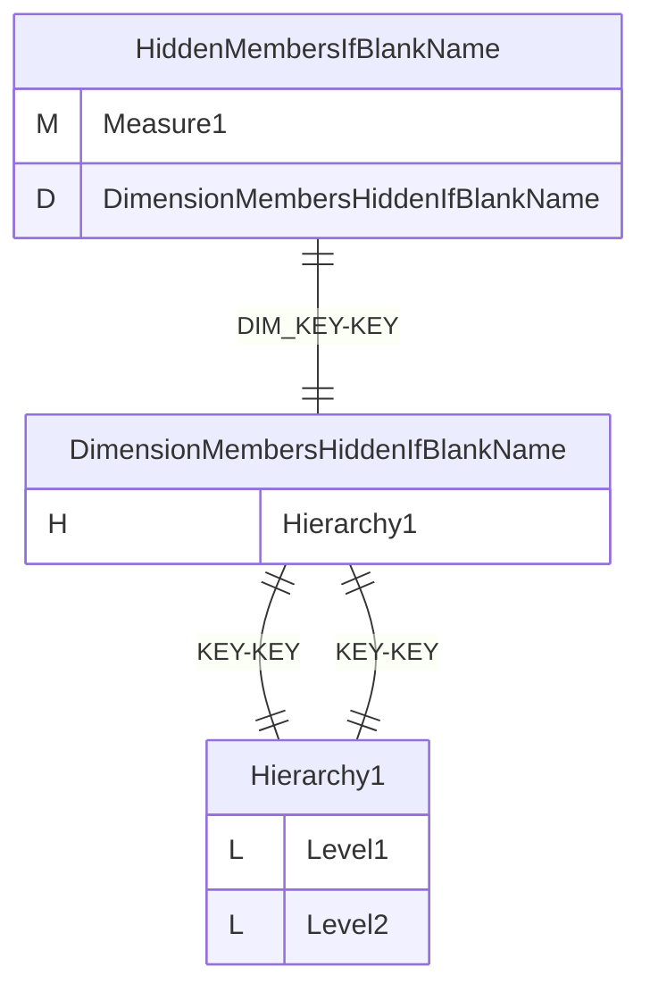
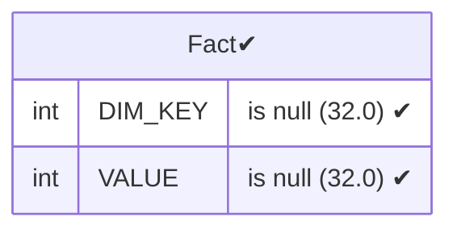
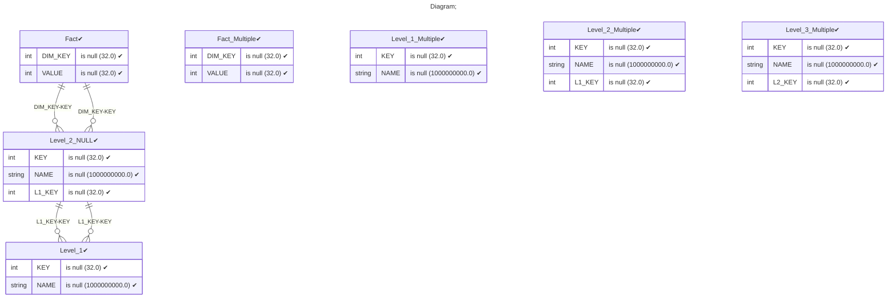
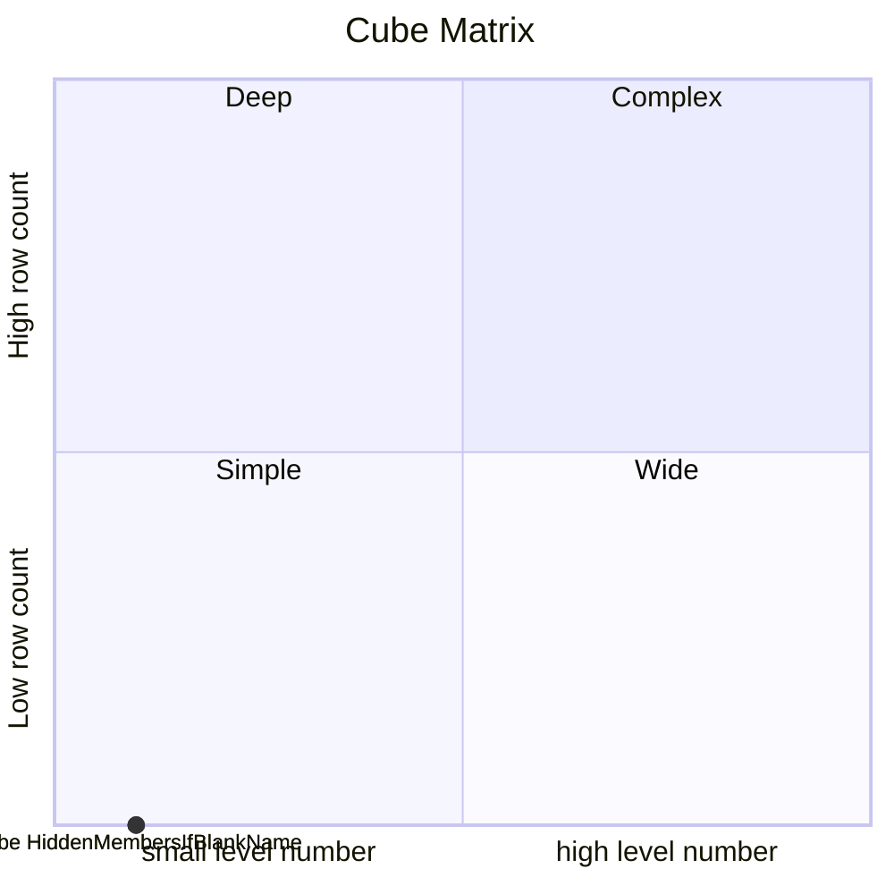

# Documentation
### CatalogName : Minimal_Single_Hierarchy_Hidden_Members_with_IfBlankName
### Schema Minimal_Single_Hierarchy_Hidden_Members_with_IfBlankName : 
---
### Cubes :

    HiddenMembersIfBlankName, HiddenMembersIfBlankName

---
#### Cube "HiddenMembersIfBlankName":

    

##### Table: "Fact"

##### Dimensions:
##### Dimension "DimensionMembersHiddenIfBlankName":

Hierarchies:

    Hierarchy1

##### Hierarchy Hierarchy1:

Tables: "Level_2_NULL,Level_1"

Levels: "Level1, Level2"

###### Level "Level1" :

    column(s): KEY

###### Level "Level2" :

    column(s): KEY

---
#### Cube "HiddenMembersIfBlankName":

    

##### Table: "Fact"

##### Dimensions:
##### Dimension "DimensionMembersHiddenIfBlankName":

Hierarchies:

    Hierarchy1

##### Hierarchy Hierarchy1:

Tables: "Level_2_NULL,Level_1"

Levels: "Level1, Level2"

###### Level "Level1" :

    column(s): KEY

###### Level "Level2" :

    column(s): KEY

### Cube "HiddenMembersIfBlankName" diagram:

---

---
### Database :
---

---
" Aggregation section:

---

---
### Cube "HiddenMembersIfBlankName" diagram:

---

---
### Database :
---

---
" Aggregation section:

---

---
### Cube Matrix for Minimal_Single_Hierarchy_Hidden_Members_with_IfBlankName:

---
### Database :
---

---
