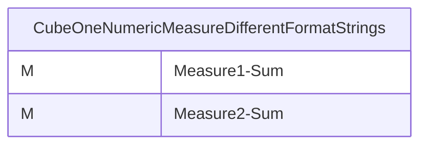
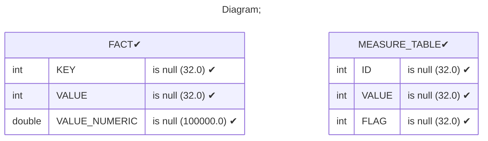
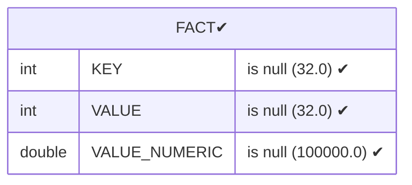
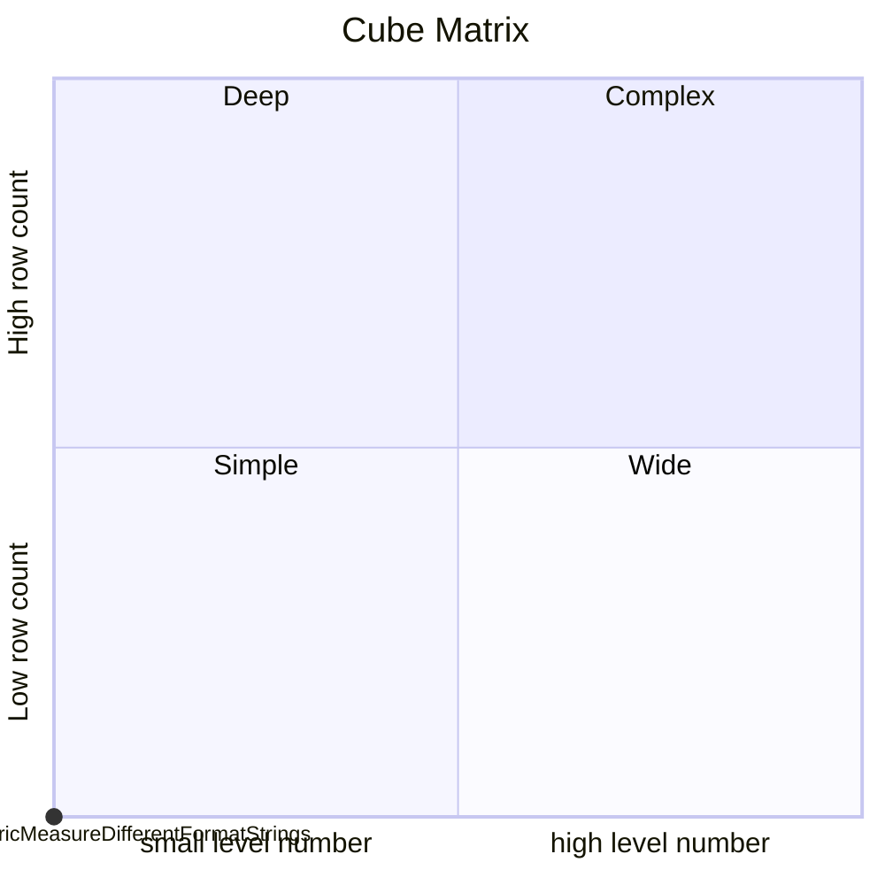

# Documentation
### CatalogName : Minimal_Cubes_With_MeasureExpression
### Schema Minimal_Cubes_With_MeasureExpression : 
---
### Cubes :

    CubeOneNumericMeasureDifferentFormatStrings

---
#### Cube "CubeOneNumericMeasureDifferentFormatStrings":

    

##### Table: "FACT"

### Cube "CubeOneNumericMeasureDifferentFormatStrings" diagram:

---

---
### Database :
---

---
" Aggregation section:

---

---
### Cube Matrix for Minimal_Cubes_With_MeasureExpression:

---
### Database :
---

---
