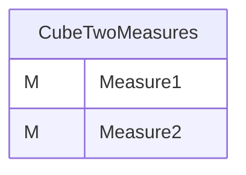
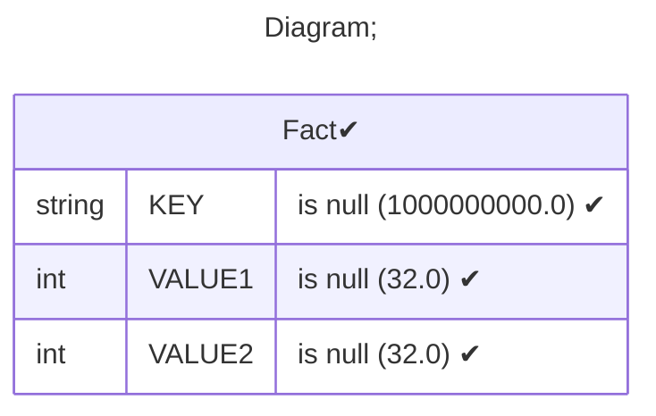
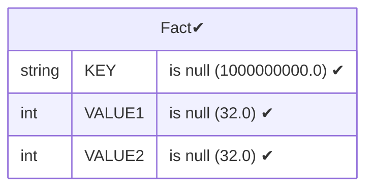
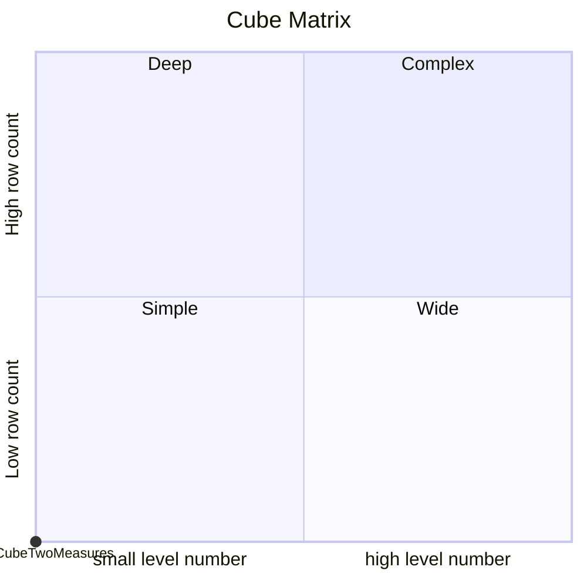

# Documentation
### CatalogName : Minimal_Cubes_With_Measures
### Schema Minimal_Cubes_With_Measures : 
---
### Cubes :

    CubeTwoMeasures

---
#### Cube "CubeTwoMeasures":

    

##### Table: "Fact"

### Cube "CubeTwoMeasures" diagram:

---

---
### Database :
---

---
" Aggregation section:

---

---
### Cube Matrix for Minimal_Cubes_With_Measures:

---
### Database :
---

---
