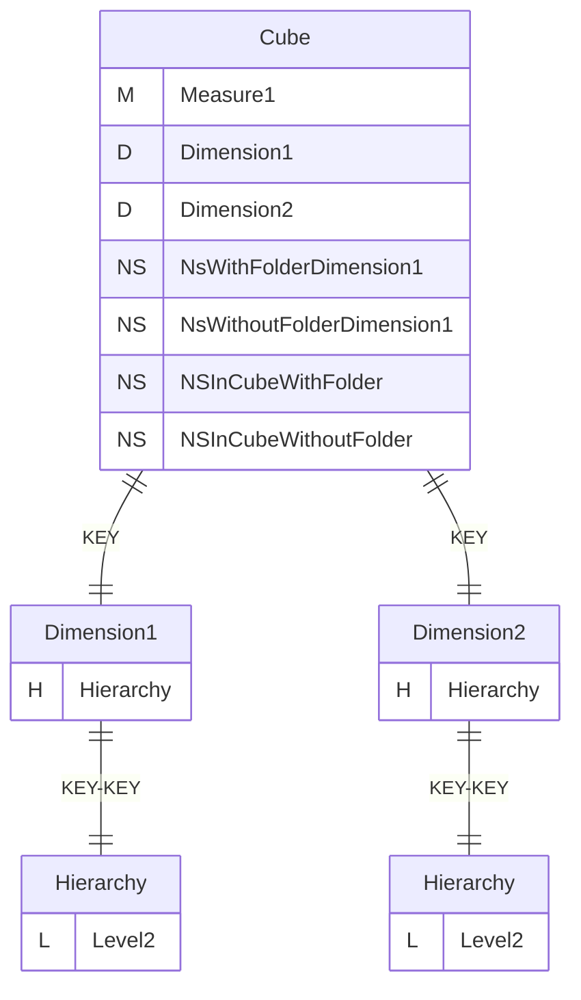
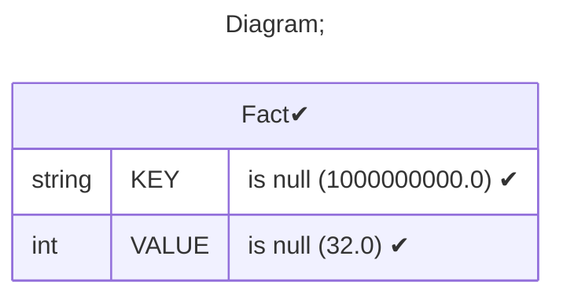
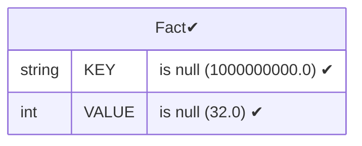
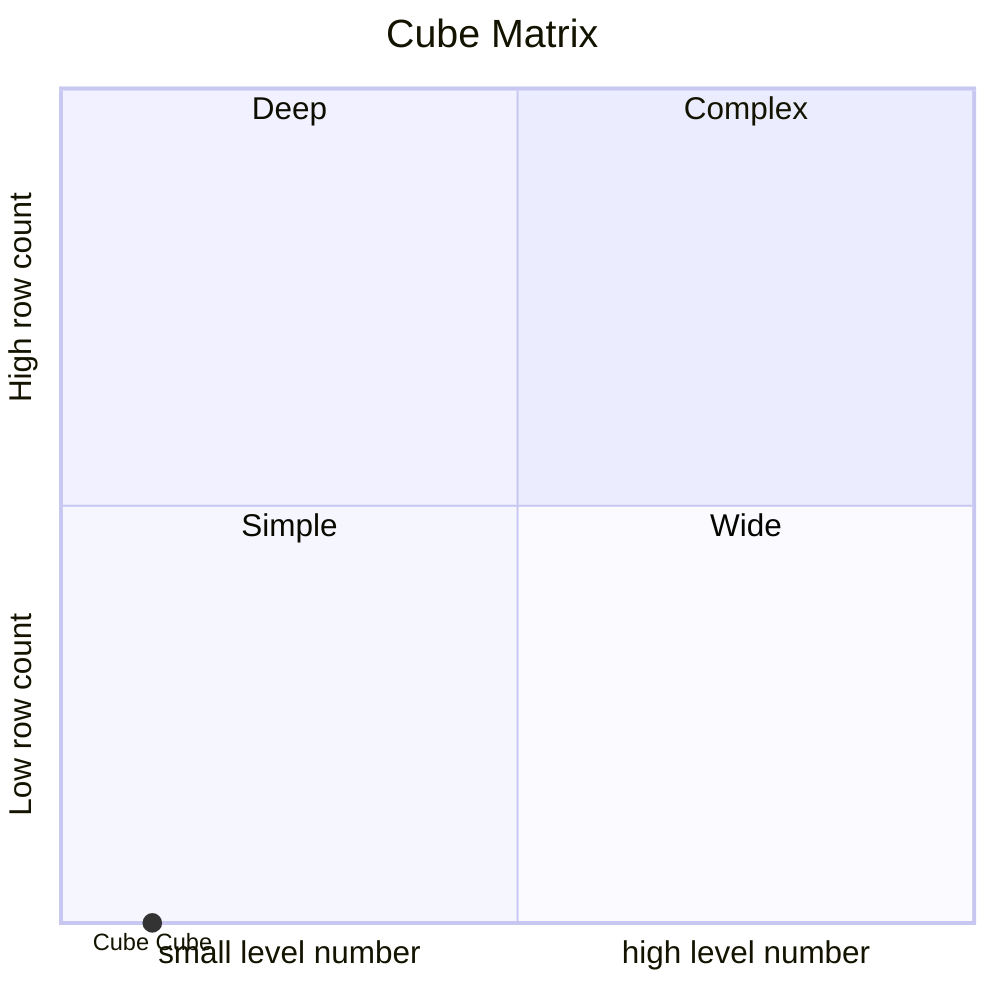

# Documentation
### CatalogName : Cube_with_NamedSet
### Schema Cube_with_NamedSet : 
---
### Cubes :

    Cube

---
#### Cube "Cube":

    

##### Table: "Fact"

##### Dimensions:
##### Dimension "Dimension1":

Hierarchies:

    Hierarchy

##### Hierarchy Hierarchy:

Tables: "Fact"

Levels: "Level2"

###### Level "Level2" :

    column(s): KEY

##### Dimension "Dimension2":

Hierarchies:

    Hierarchy

##### Hierarchy Hierarchy:

Tables: "Fact"

Levels: "Level2"

###### Level "Level2" :

    column(s): KEY

### Cube "Cube" diagram:

---

---
### Database :
---

---
" Aggregation section:

---

---
### Cube Matrix for Cube_with_NamedSet:

---
### Database :
---

---
