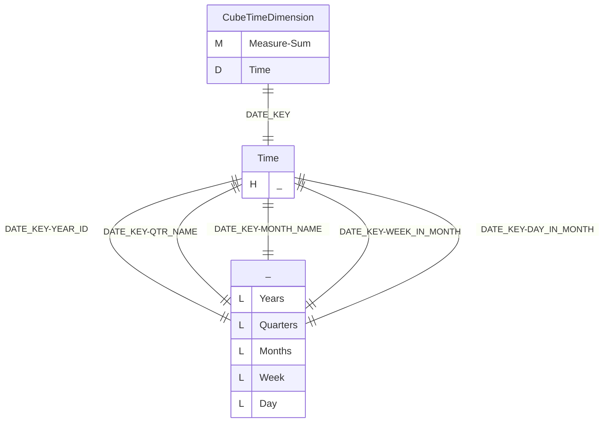
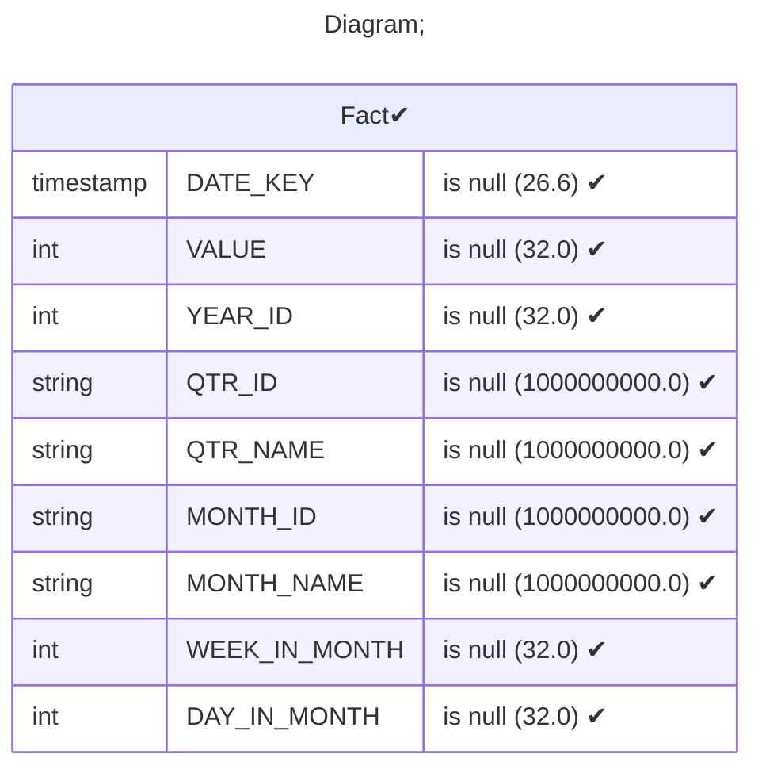
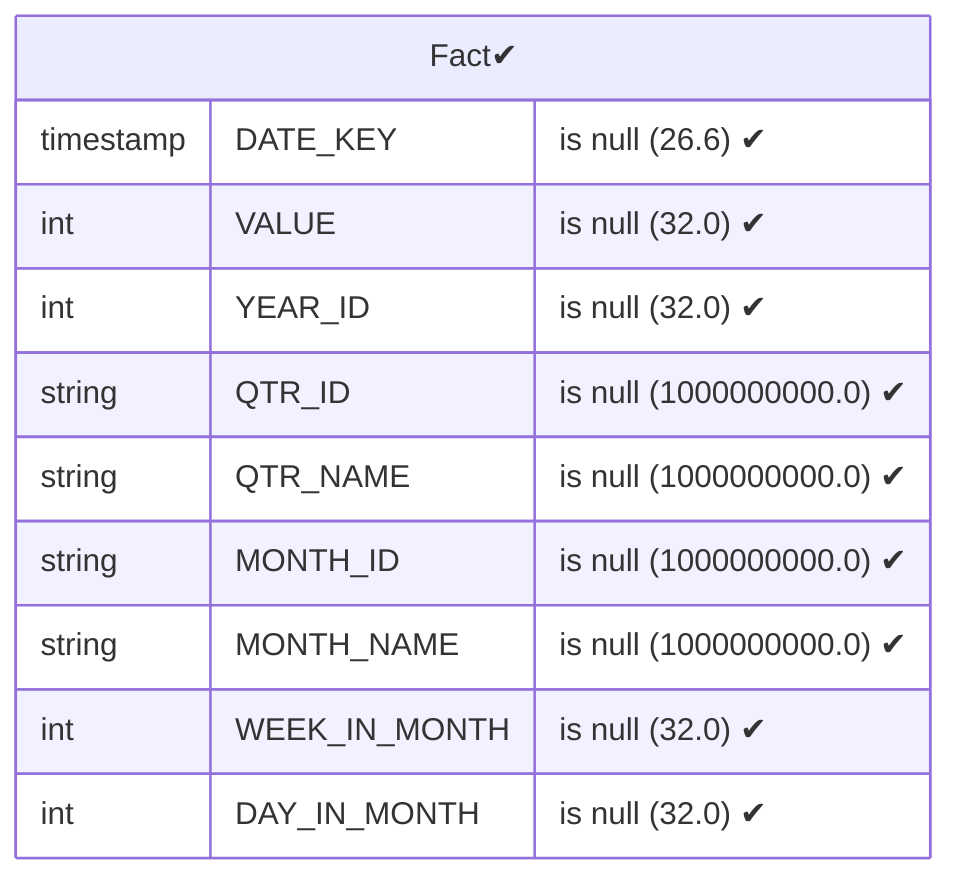
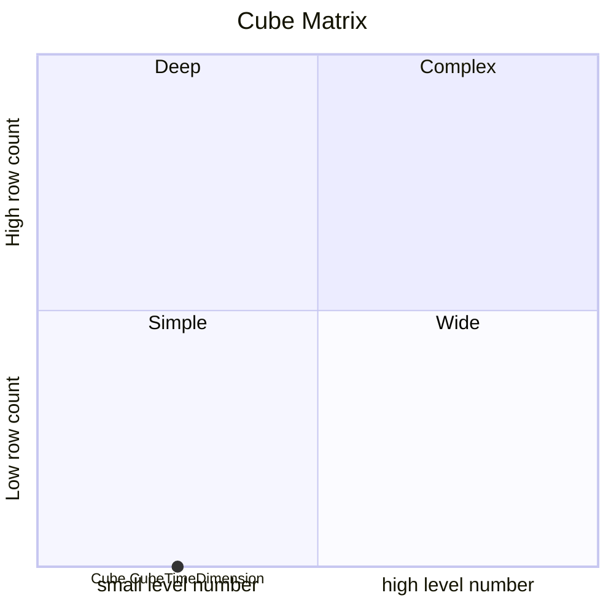

# Documentation
### CatalogName : Minimal_Cube_with_Time_Dimension
### Schema Minimal_Cube_with_Time_Dimension : 
---
### Cubes :

    CubeTimeDimension

---
#### Cube "CubeTimeDimension":

    

##### Table: "Fact"

##### Dimensions:
##### Dimension "Time":

Hierarchies:

    Hierarchy0

##### Hierarchy Hierarchy0:

Tables: "Fact"

Levels: "Years, Quarters, Months, Week, Day"

###### Level "Years" :

    column(s): YEAR_ID

###### Level "Quarters" :

    column(s): QTR_NAME

###### Level "Months" :

    column(s): MONTH_NAME

###### Level "Week" :

    column(s): WEEK_IN_MONTH

###### Level "Day" :

    column(s): DAY_IN_MONTH

### Cube "CubeTimeDimension" diagram:

---

---
### Database :
---

---
" Aggregation section:

---

---
### Cube Matrix for Minimal_Cube_with_Time_Dimension:

---
### Database :
---

---
