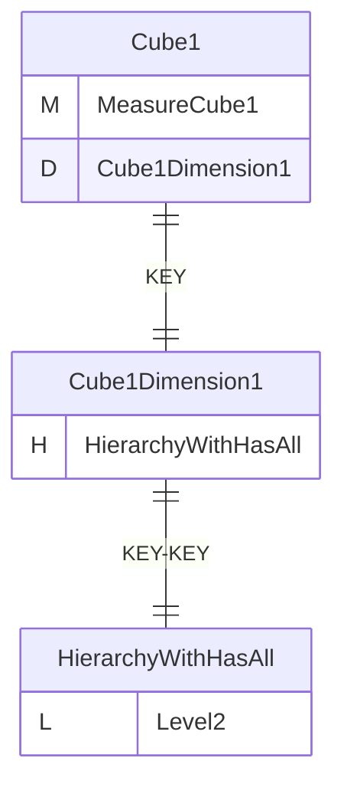
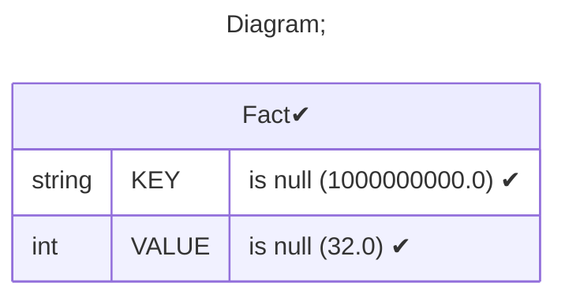
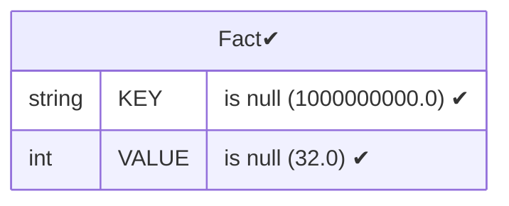
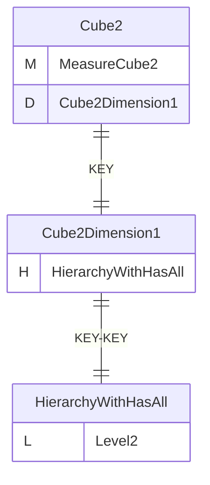
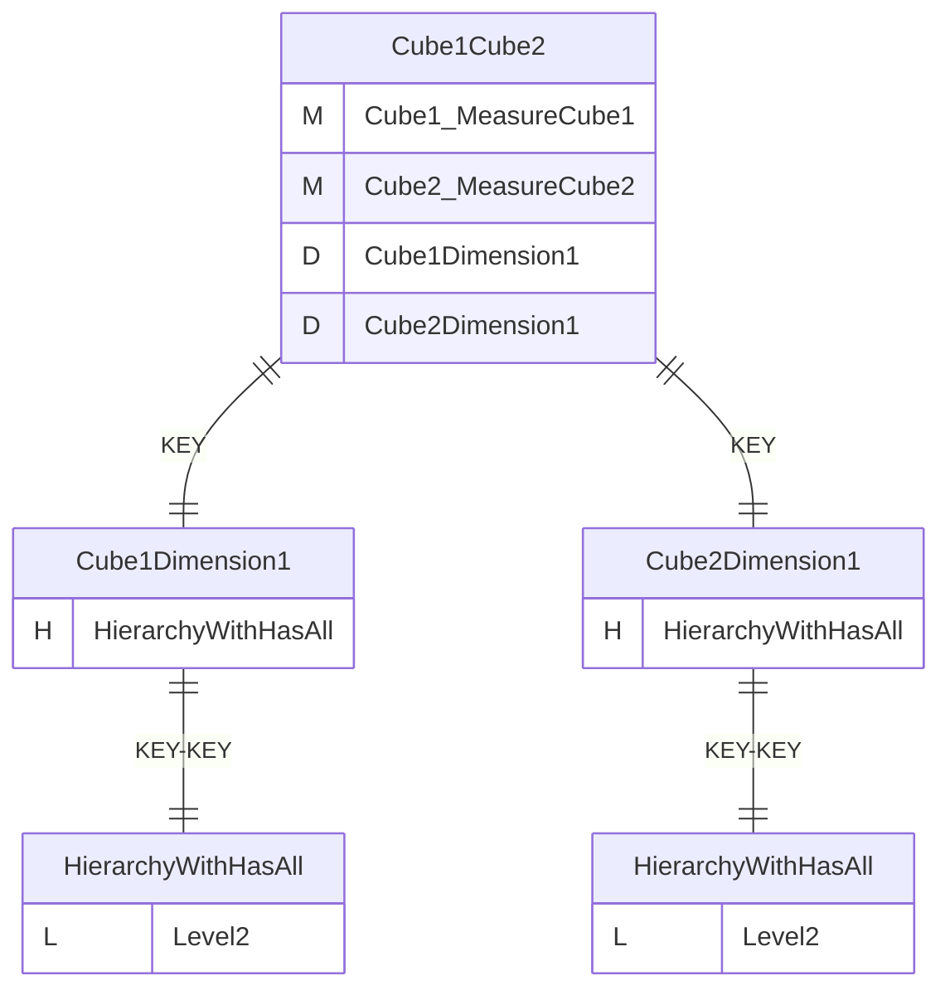
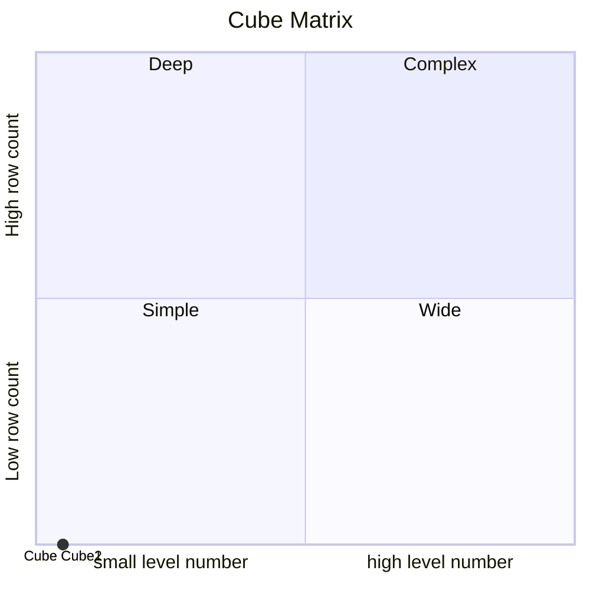

# Documentation
### CatalogName : Cube_with_virtual_cube_with_un_visible_reference_cube
### Schema Cube_with_virtual_cube_with_un_visible_reference_cube : 
---
### Cubes :

    Cube1, Cube2, Cube1Cube2

---
#### Cube "Cube1":

    

##### Table: "Fact"

##### Dimensions:
##### Dimension "Cube1Dimension1":

Hierarchies:

    HierarchyWithHasAll

##### Hierarchy HierarchyWithHasAll:

Tables: "Fact"

Levels: "Level2"

###### Level "Level2" :

    column(s): KEY

---
#### Cube "Cube2":

    

##### Table: "Fact"

##### Dimensions:
##### Dimension "Cube2Dimension1":

Hierarchies:

    HierarchyWithHasAll

##### Hierarchy HierarchyWithHasAll:

Tables: "Fact"

Levels: "Level2"

###### Level "Level2" :

    column(s): KEY

### Cube "Cube1" diagram:

---

---
### Database :
---

---
" Aggregation section:

---

---
### Cube "Cube2" diagram:

---

---
### Database :
---

---
" Aggregation section:

---

---
### Virtual Cube "Cube1Cube2" diagram:

---

---
### Cube Matrix for Cube_with_virtual_cube_with_un_visible_reference_cube:

---
### Database :
---

---
