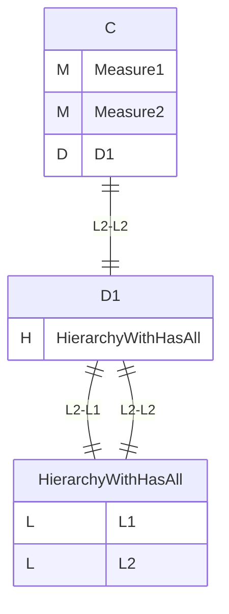
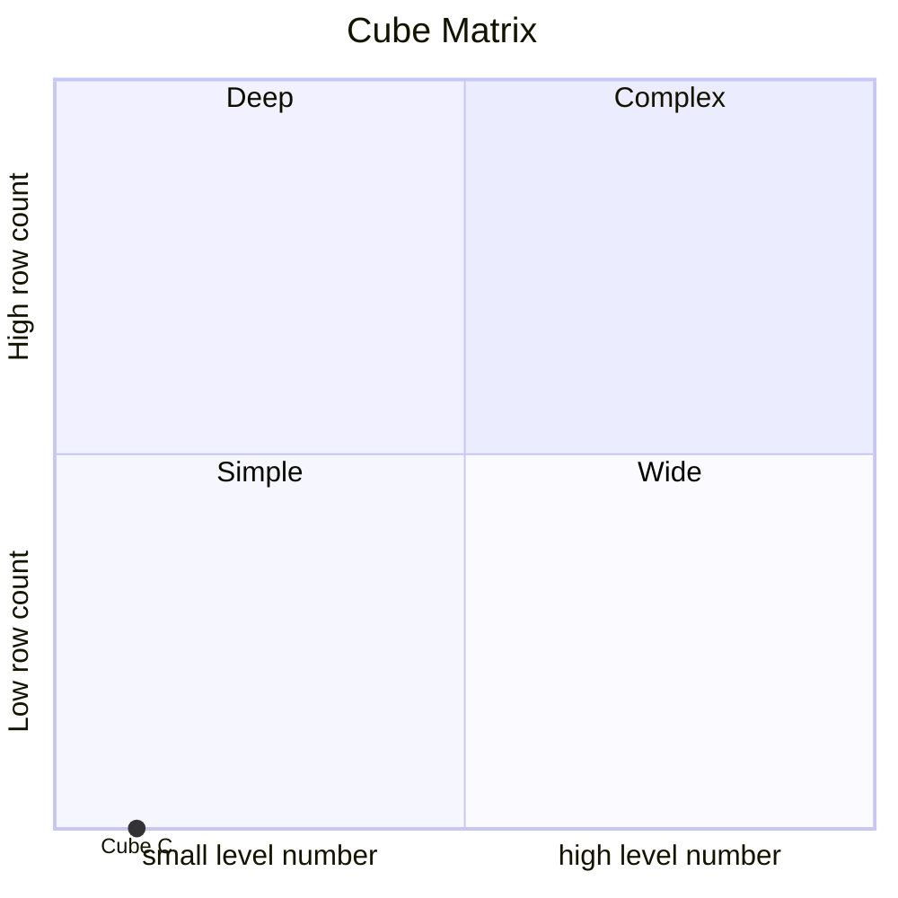
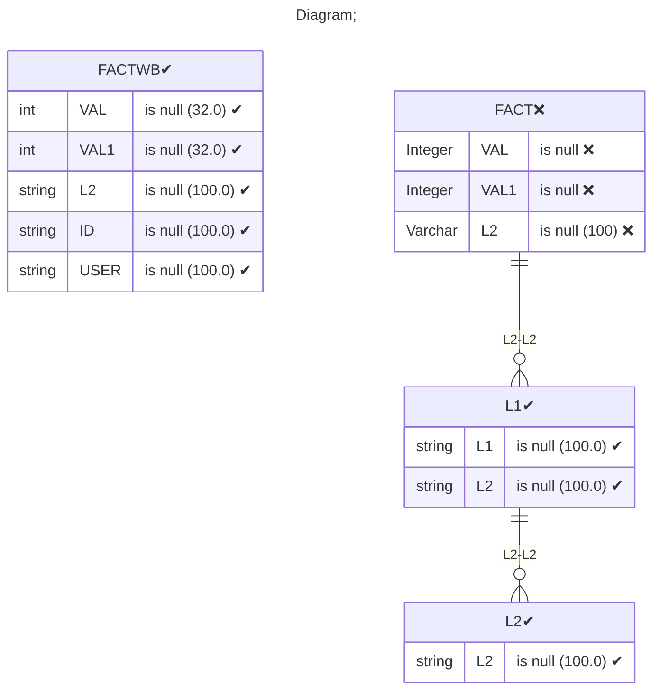

# Documentation
### CatalogName : tutorial_for_writeback_with_fact_InlineTable
### Schema tutorial_for_writeback_with_fact_InlineTable : 
---
### Cubes :

    C

---
#### Cube "C":

    

##### Table: ""

##### Dimensions:
##### Dimension "D1":

Hierarchies:

    HierarchyWithHasAll

##### Hierarchy HierarchyWithHasAll:

Tables: "L1,L2"

Levels: "L1, L2"

###### Level "L1" :

    column(s): L1

###### Level "L2" :

    column(s): L2

### Cube "C" diagram:

---

---
### Cube Matrix for tutorial_for_writeback_with_fact_InlineTable:

---
### Database :
---

---
