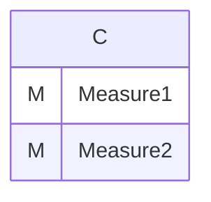
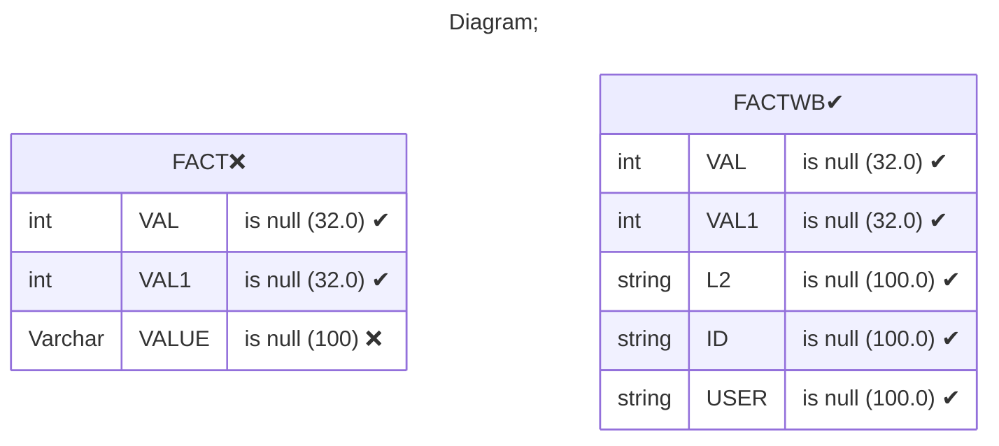
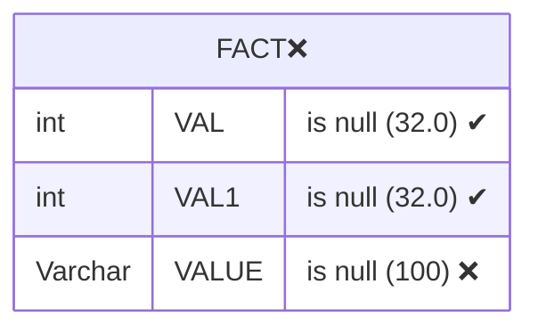
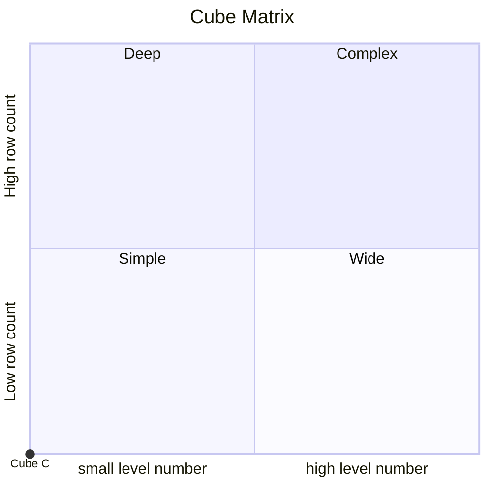

# Documentation
### CatalogName : Writeback_without_dimension
### Schema Writeback_without_dimension : 
---
### Cubes :

    C

---
#### Cube "C":

    

##### Table: "FACT"

### Cube "C" diagram:

---

---
### Database :
---

---
" Aggregation section:

---

---
### Cube Matrix for Writeback_without_dimension:

---
### Database :
---

---
